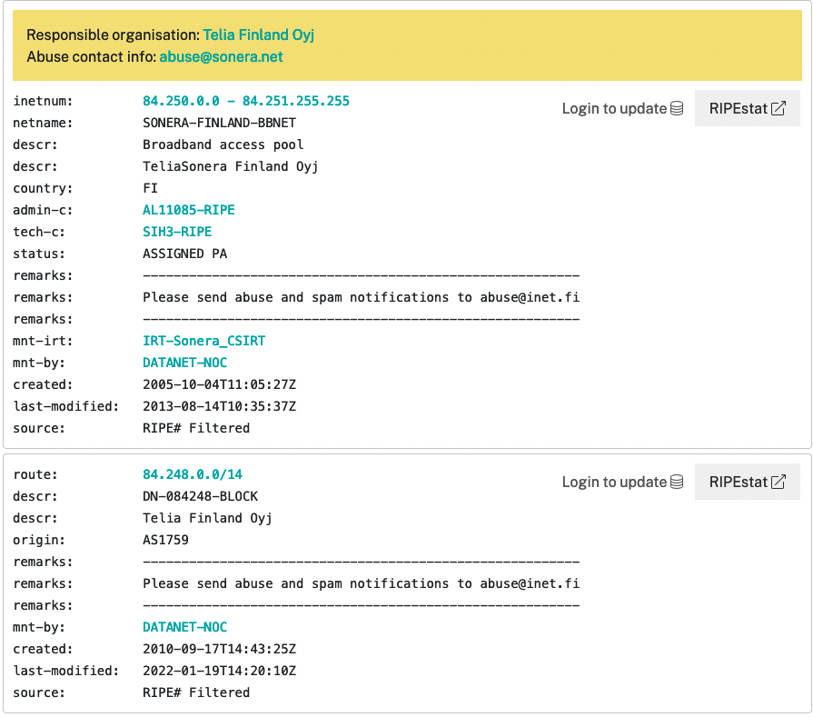

# Documentation for E03


## Student number from Peppi

```
2112415
vvxyzki
```

> Use your own student number and form the following subnets:
10.xy.yz.0/24 and 192.168.ki.0/24

```
 10.12.24.0/24 and 192.168.15.0/24
```
## Exercise 1


> What is the usable (host) address range of  192.168.15.0/24? 
What is the broadcast address? 
What is the subnet address? 

###  **Solution logic**

```
1111 1111. 1111 1111. 1111 1111. 0000 0000.
ssss ssss. ssss ssss. ssss ssss. hhhh hhhh.

hhhh hhhh. BIN(0-1)   |   DEC
0000 0000             |   .0
0000 0001             |   .1 -first usable 
0000 0010             |   .2
0000 0011             |   .3
0000 0100             |   .4
0000 0101             |   .5
....
1111 1110             |  .254 -last usable 
1111 1111             |  .255 -broadcast address 


/24 is a subnet mask 


Answer: 192.168.15.1 - 192.168.15.254
```


## Exercise 2

> Divide the 192.168.15.0/24 into smaller subnets with (atleast) 50 hosts in each. Notice! Make as small of a subnet/subnets as you can!


###  **Solution logic** 

```
h= host bits 
2^h formula for calculating subnets
2^8=256-2(subnet and broadcast)=254 usable adresses
2^7=128 host adresses
2^6=64 adresses <-the smallest we can do
2^5=32 adresses 

By default there are 254 hosts 

    255.       255.       255.      192   (DEC)    
1111 1111. 1111 1111. 1111 1111. 1100 0000. (BINARY)
ssss ssss. ssss ssss. ssss ssss. sshh hhhh.

we get /26 subnet bits 
255.255.255.192 - subnet mask 


192.168.15.0/26

hh hhhh
00 0000     |subnet address
00 0001     |first usable adress 
00 0010     
00 0100
...
11 1100     |.60
11 1101     |.61
11 1110     |.62 last usable adress
11 1111     |.63 broadcast        


Answers:
* Broadcast address: 192.168.15.63
* What is the subnet address: 192.168.15.0
* Usable host range 192.168.15.1-192.168.15.62
```


| Specification                         | Subnet info     |  
|---------------------------------------|-----------------|
| Network address                       | 192.168.15.0/26 |   
| New subnet mask                       | 255.255.255.192 |   
| Number of usable hosts in the subnet  | 62              |   
| First IP Host address                 | 192.168.15.1    |   
| Last IP Host address                  | 192.168.15.62   |   
| Broadcast address                     | 192.168.15.63   |    


## Exercise 3

> Divide the 10.12.24.0/24 into smaller subnets:
The subnets have to be as small as possible (usable hosts)
The subnets must have the capability to support 13 hosts
in each of the subnets 


###  **Solution logic**


```
2^7=128 addresses
2^6=64 addresses
2^5=32 addresses
2^4=16         <-the best one
2^3=8

h = 4
s = 24 + 4 = 28


    255.       255.       255.      240.
1111 1111. 1111 1111. 1111 1111. 0000 0000.  
ssss ssss. ssss ssss. ssss ssss. hhhh hhhh.
```


### First subnet
```
ssss|hhhh
0000 0000   .0
0000 0001   .1
...
0000 1110   .14
0000 1111   .15
```


| Specification                          | Subnet info     |
|----------------------------------------|-----------------|
| New subnet mask                        | 255.255.255.240 |
| Number of usable hosts in the subnet 	 | 13              |
| Network address                        | 10.12.24.0/28   |
| First IP Host address                  | 10.12.24.1      |
| Last IP Host address                   | 10.12.24.14     |
| Broadcast address                      | 10.12.24.15     |


### Second subnet

```
ssss|hhhh
0001 0000   .16
0001 0001   .17
...
0001 1110   .30
0001 1111   .31
```


| Specification                          | Subnet info     |
|----------------------------------------|-----------------|
| New subnet mask                        | 255.255.255.240 |
| Number of usable hosts in the subnet 	 | 13              |
| Network address                        | 10.12.24.16/28  |
| First IP Host address                  | 10.12.24.17     |
| Last IP Host address                   | 10.12.24.30     |
| Broadcast address                      | 10.12.24.31     |


### Third subnet
```
ssss|hhhh
0010 0000   .32
0010 0001   .33
...
0010 1110   .46
0010 1111   .47
```

| Specification                          | Subnet info     |
|----------------------------------------|-----------------|
| New subnet mask                        | 255.255.255.240 |
| Number of usable hosts in the subnet 	 | 13              |
| Network address                        | 10.12.24.32/28  |
| First IP Host address                  | 10.12.24.33     |
| Last IP Host address                   | 10.12.24.46     |
| Broadcast address                      | 10.12.24.47     |


### Fourth subnet
```
ssss|hhhh
0011 0000   .48
0011 0001   .49
...
0011 1110   .62
0011 1111   .63
```

| Specification                          | Subnet info     |
|----------------------------------------|-----------------|
| New subnet mask                        | 255.255.255.240 |
| Number of usable hosts in the subnet 	 | 13              |
| Network address                        | 10.12.24.48/28  |
| First IP Host address                  | 10.12.24.49     |
| Last IP Host address                   | 10.12.24.62     |
| Broadcast address                      | 10.12.24.63     |


### Fifth subnet
```
ssss|hhhh
0100 0000   .64
0100 0001   .65
...
0100 1110   .78
0100 1111   .79
```

| Specification                          | Subnet info     |
|----------------------------------------|-----------------|
| New subnet mask                        | 255.255.255.240 |
| Number of usable hosts in the subnet 	 | 13              |
| Network address                        | 10.12.24.64/28  |
| First IP Host address                  | 10.12.24.65     |
| Last IP Host address                   | 10.12.24.78     |
| Broadcast address                      | 10.12.24.79     |


### Sixth subnet

```
ssss|hhhh
0101 0000   .80
0101 0001   .81
...
0101 1110   .94
0101 1111   .95
```

| Specification                          | Subnet info     |
|----------------------------------------|-----------------|
| New subnet mask                        | 255.255.255.240 |
| Number of usable hosts in the subnet 	 | 13              |
| Network address                        | 10.12.24.80/28  |
| First IP Host address                  | 10.12.24.81     |
| Last IP Host address                   | 10.12.24.94     |
| Broadcast address                      | 10.12.24.95     |


### Seventh subnet

```
ssss|hhhh
0110 0000   .96
0110 0001   .97
...
0110 1110   .110
0110 1111   .111
```


| Specification                          | Subnet info     |
|----------------------------------------|-----------------|
| New subnet mask                        | 255.255.255.240 |
| Number of usable hosts in the subnet 	 | 13              |
| Network address                        | 10.12.24.96/28  |
| First IP Host address                  | 10.12.24.97     |
| Last IP Host address                   | 10.12.24.110    |
| Broadcast address                      | 10.12.24.111    |


### Eighth subnet

```
ssss|hhhh
0111 0000   .112
0111 0001   .113
...
0111 1110   .126
0111 1111   .127
```

| Specification                          | Subnet info     |
|----------------------------------------|-----------------|
| New subnet mask                        | 255.255.255.240 |
| Number of usable hosts in the subnet 	 | 13              |
| Network address                        | 10.12.24.112/28 |
| First IP Host address                  | 10.12.24.113    |
| Last IP Host address                   | 10.12.24.126    |
| Broadcast address                      | 10.12.24.127    |


### Ninth subnet

```
ssss|hhhh
1000 0000   .128
1000 0001   .129
...
1000 1110   .142
1000 1111   .143
```

| Specification                          | Subnet info     |
|----------------------------------------|-----------------|
| New subnet mask                        | 255.255.255.240 |
| Number of usable hosts in the subnet 	 | 13              |
| Network address                        | 10.12.24.128/28 |
| First IP Host address                  | 10.12.24.129    |
| Last IP Host address                   | 10.12.24.142    |
| Broadcast address                      | 10.12.24.143    |


### Tenth subnet

```
ssss|hhhh
1001 0000   .144
1001 0001   .145
...
1001 1110   .158
1001 1111   .159
```

| Specification                          | Subnet info     |
|----------------------------------------|-----------------|
| New subnet mask                        | 255.255.255.240 |
| Number of usable hosts in the subnet 	 | 13              |
| Network address                        | 10.12.24.144/28 |
| First IP Host address                  | 10.12.24.145    |
| Last IP Host address                   | 10.12.24.158    |
| Broadcast address                      | 10.12.24.159    |


### Eleventh subnet

```
ssss|hhhh
1010 0000   .160
1010 0001   .161
...
1010 1110   .174
1010 1111   .175
```

| Specification                          | Subnet info     |
|----------------------------------------|-----------------|
| New subnet mask                        | 255.255.255.240 |
| Number of usable hosts in the subnet 	 | 13              |
| Network address                        | 10.12.24.160/28 |
| First IP Host address                  | 10.12.24.161    |
| Last IP Host address                   | 10.12.24.174    |
| Broadcast address                      | 10.12.24.175    |


### Twelth subnet

```
ssss|hhhh
1011 0000   .176
1011 0001   .177
...
1011 1110   .190
1011 1111   .191
```

| Specification                          | Subnet info     |
|----------------------------------------|-----------------|
| New subnet mask                        | 255.255.255.240 |
| Number of usable hosts in the subnet 	 | 13              |
| Network address                        | 10.12.24.176/28 |
| First IP Host address                  | 10.12.24.177    |
| Last IP Host address                   | 10.12.24.190    |
| Broadcast address                      | 10.12.24.191    |


### Thirteenth subnet

```
ssss|hhhh
1100 0000   .192
1100 0001   .193
...
1100 1110   .206
1100 1111   .207
```


| Specification                          | Subnet info      |
|----------------------------------------|------------------|
| New subnet mask                        | 255.255.255.240  |
| Number of usable hosts in the subnet 	 | 13               |
| Network address                        | 10.12.24.192/28	|
| First IP Host address                  | 10.12.24.193     |
| Last IP Host address                   | 10.12.24.206     |
| Broadcast address                      | 10.12.24.207     |


### Fourteenth subnet

```
ssss|hhhh
1101 0000   .208
1101 0001   .209
...
1101 1110   .222
1101 1111   .223
```


| Specification                          | Subnet info     |
|----------------------------------------|-----------------|
| New subnet mask                        | 255.255.255.240 |
| Number of usable hosts in the subnet 	 | 13              |
| Network address                        | 10.12.24.208/28 |
| First IP Host address                  | 10.12.24.209    |
| Last IP Host address                   | 10.12.24.222    |
| Broadcast address                      | 10.12.24.223    |


### Fifteenth subnet 

```
ssss|hhhh
1110 0000   .224
1110 0001   .225
...
1110 1110   .238
1110 1111   .239
```


| Specification                          | Subnet info      |
|----------------------------------------|------------------|
| New subnet mask                        | 255.255.255.240  |
| Number of usable hosts in the subnet 	 | 13               |
| Network address                        | 10.12.24.224/28	|
| First IP Host address                  | 10.12.24.225     |
| Last IP Host address                   | 10.12.24.238     |
| Broadcast address                      | 10.12.24.239     |


### Sixteenth subnet

```
ssss|hhhh
1110 0000   .240
1110 0001   .241
...
1110 1110   .254
1110 1111   .255
```


| Specification                          | Subnet info     |
|----------------------------------------|-----------------|
| New subnet mask                        | 255.255.255.240 |
| Number of usable hosts in the subnet 	 | 13              |
| Network address                        | 10.12.24.240/28 |
| First IP Host address                  | 10.12.24.241    |
| Last IP Host address                   | 10.12.24.254    |
| Broadcast address                      | 10.12.24.255    |


## Exercise 4


Exercise 4

Divide the last subnet, of from exercise 3, into smaller subnets:

The subnets have to be as small as possible (usable hosts)
The subnets must have the capability to support 2 hosts in each of the subnets

The subnets have to be as small as possible (usable hosts)


| Subnet mask       | Network address | First host address | Last host address | Broadcast address | Usable addresses |
| :---------------- | :-------------- | :----------------- | :---------------- | :---------------- | :--------------- |
|255.255.255.252    | 10.12.24.240/30 | 10.12.24.241       |  10.12.24.242     | 10.12.24.243      |        2         |
|255.255.255.252    | 10.12.24.244/30 | 10.12.24.245       |  10.12.24.246     | 10.12.24.247      |        2         |


## Exercise 5 

> Is subnet 10.12.24.0/24 a part of the supernet 10.12.16.0/20? 

###  **Solution logic**

### **Subnet** *10.12.24.0/24*

| Specification                          | Subnet info   |
|----------------------------------------|---------------|
| Subnet mask                            | 255.255.255.0 |
| Number of usable hosts in the subnet 	 | 254           |
| Network address                        | 10.12.24.0/24 |
| First IP Host address                  | 10.12.24.1    |
| Last IP Host address                   | 10.12.24.254  |
| Broadcast address                      | 10.12.24.255  |


### **Supernet** *10.12.16.0/20*

| Specification                          | Supernet info  |
|----------------------------------------|----------------|
| Subnet mask                            | 255.255.240.0  |
| Number of usable hosts in the subnet 	 | 4094	          |
| Network address                        | 10.12.16.0/20  |
| First IP Host address                  | 10.12.16.1     |
| Last IP Host address                   | 10.12.31.254   |
| Broadcast address                      | 10.12.31.255   |


<br>
<br>
<br>

Lets subnet **supernet** 10.12.16.0/20 to the size of /24. We got 2^4=16 subnet adresses in range of 10.12.16.0/24 - 10.12.31.0/24. It includes 
**subnet** 10.12.24.0/24

## Exercise 6

> Is subnet 10.12.24.0/24 a part of supernet 10.0.0.0/8? 

### **Subnet** *10.12.24.0/24*


| Specification                          | Subnet info   |
|----------------------------------------|---------------|
| Subnet mask                            | 255.255.255.0 |
| Number of usable hosts in the subnet 	 | 254           |
| Network address                        | 10.12.24.0    |
| First IP Host address                  | 10.12.24.1    |
| Last IP Host address                   | 10.12.24.254  |
| Broadcast address                      | 10.12.24.255	 |


### **Supernet** *10.0.0.0/8*

| Specification                          | Supernet info  |
|----------------------------------------|----------------|
| Subnet mask                            | 255.0.0.0      |
| Number of usable hosts in the subnet 	 | 16777214       |
| Network address                        | 10.0.0.0       |
| First IP Host address                  | 10.0.0.1       |
| Last IP Host address                   | 10.255.255.254 |
| Broadcast address                      | 10.255.255.255 |

<br>
<br>
<br>

Lets subnet **supernet** 10.0.0.0/8 to the size of /24. We got 2^16=65534 subnet adresses in range of 10.0.0.0/24 - 10.255.255.0/24. It includes **subnet** 
10.12.24.0/24
<br>
<br>
<br>

## Investigation of the IP with ripe.net



## Internet registries

> Fill the following addresses with your student number: 195.12.24.0/24, 43.12.15.0/24, 15.15.12.0/24 and 100.24.15.0/24. Search to whom they are registered to


```
195.12.24.0/24 
This ip is registered to RIPE NNC
``` 


```
43.12.15.0/24
This ip is registered to APNIC
```

```
15.15.12.0/24
This ip is registered to ARIN
```

```
100.24.15.0/24
This ip is registered to ARIN
```