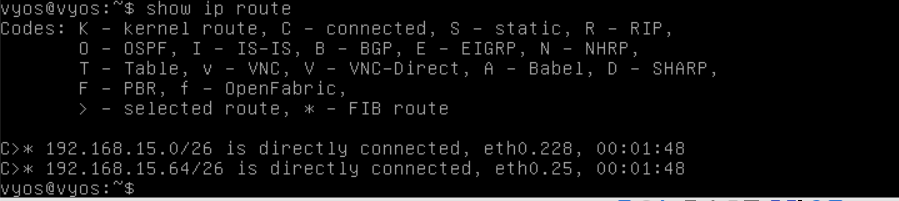

# Documentation for E04

## Physical topology


<br>
<br>
<br>
<br>
<br>

## Logical topology 


<br>
<br>
<br>
<br>
<br>


## Network settings of the Switch 2


## Adding "brave_new_vlan"

## Switch 1


## Switch 2


## Configuration of two VLAN interfaces on Vyos router


## *show interfaces* on vyos


## *show ip route* on vyos


## Manual change of the network settings on Lubuntus

## Lubuntu 1


## Lubuntu 2


## *ip addr* of Lubuntu 1
```
lubuntu@lubuntu-virtualbox:~$ ip addr
1: lo: <LOOPBACK,UP,LOWER_UP> mtu 65536 qdisc noqueue state UNKNOWN group default qlen 1000
    link/loopback 00:00:00:00:00:00 brd 00:00:00:00:00:00
    inet 127.0.0.1/8 scope host lo
       valid_lft forever preferred_lft forever
    inet6 ::1/128 scope host 
       valid_lft forever preferred_lft forever
2: enp0s3: <BROADCAST,MULTICAST,UP,LOWER_UP> mtu 1500 qdisc fq_codel state UP group default qlen 1000
    link/ether 08:00:27:46:5a:b0 brd ff:ff:ff:ff:ff:ff
    inet 192.168.15.1/26 brd 192.168.15.63 scope global noprefixroute enp0s3
       valid_lft forever preferred_lft forever
    inet6 fe80::71cd:d51c:49cd:e80b/64 scope link noprefixroute 
       valid_lft forever preferred_lft forever
```

## *ip addr* of Lubuntu 2
```
lubuntu@lubuntu-virtualbox:~$ ip addr
1: lo: <LOOPBACK,UP,LOWER_UP> mtu 65536 qdisc noqueue state UNKNOWN group default qlen 1000
    link/loopback 00:00:00:00:00:00 brd 00:00:00:00:00:00
    inet 127.0.0.1/8 scope host lo
       valid_lft forever preferred_lft forever
    inet6 ::1/128 scope host 
       valid_lft forever preferred_lft forever
2: enp0s3: <BROADCAST,MULTICAST,UP,LOWER_UP> mtu 1500 qdisc fq_codel state UP group default qlen 1000
    link/ether 08:00:27:e2:73:9f brd ff:ff:ff:ff:ff:ff
    inet 192.168.15.65/26 brd 192.168.15.127 scope global noprefixroute enp0s3
       valid_lft forever preferred_lft forever
    inet6 fe80::71cd:d51c:49cd:e80b/64 scope link noprefixroute 
       valid_lft forever preferred_lft forever
```

## *traceroute* Lubuntu 2 from Lubuntu 1
```
lubuntu@lubuntu-virtualbox:~$ traceroute 192.168.15.65
traceroute to 192.168.15.65 (192.168.15.65), 64 hops max
  1   192.168.15.62  2,698ms  2,277ms  2,882ms 
  2   192.168.15.65  3,437ms  3,977ms  2,614ms 
```

## *traceroute* Lubuntu 1 from Lubuntu 2
```
lubuntu@lubuntu-virtualbox:~$ traceroute 192.168.15.1
traceroute to 192.168.15.1 (192.168.15.1), 64 hops max
  1   192.168.15.126  11,550ms  0,801ms  0,750ms 
  2   192.168.15.1  2,278ms  1,954ms  1,784ms 
```

Great! Our router connection is working and now we can see .62 and .126 besides Lubuntus IPs.

<br>

Now let's add "network_device" vlan and check if it works

##  *show interfaces* command on vyos after adding the "network_device" vlan


## *show ip route* command after adding the "network_device" vlan 


## Configuration of switches after adding all the necessary ports, vlans and configuring an ip adress for "network_devices"

<br>
<br>

## Switch1


## Switch2


## Configuration of the vyos 

```
vyos@vyos# show
 interfaces {
     ethernet eth0 {
         duplex auto
         hw-id 08:00:27:2d:bd:e9
         smp-affinity auto
         speed auto
         vif 25 {
             address 192.168.15.126/26
         }
         vif 40 {
             address 10.12.24.14/28
         }
         vif 228 {
             address 192.168.15.62/26
         }
     }
     loopback lo {
     }
 }
 protocols {
 }
 service {
     ssh {
         port 22
     }
 }
 system {
     config-management {
         commit-revisions 100
     }
     console {
         device ttyS0 {
             speed 9600
         }
     }
     host-name vyos
     login {
         user vyos {
             authentication {
                 encrypted-password $6$EKHTHLPZKERb/Hdz$Mlc3fond5GwtNcrL5u/SW6IceGrFY7xak7XxJcwWSYh1tVVrjs1rKlrL8N1edYx4KyvhFpRLuRmyku1xfzEVi0
                 plaintext-password ""
             }
             level admin
         }
     }
     syslog {
         global {
             facility all {
                 level info
             }
             facility protocols {
                 level debug
             }
         }
     }
     time-zone UTC
 }


```

## Let's now try ssh to Vyos
<br>
<br>


## *SSH* from Lubuntu 1


## *SSH* from Lubuntu 2


## Connectivity tests 

## *Ping* Lubuntu 1 from Lubuntu 2

```
lubuntu@lubuntu-virtualbox:~$ ping 192.168.15.1
PING 192.168.15.1 (192.168.15.1) 56(84) bytes of data.
64 bytes from 192.168.15.1: icmp_seq=1 ttl=63 time=4.94 ms
64 bytes from 192.168.15.1: icmp_seq=2 ttl=63 time=3.93 ms
64 bytes from 192.168.15.1: icmp_seq=3 ttl=63 time=4.93 ms
64 bytes from 192.168.15.1: icmp_seq=4 ttl=63 time=3.96 ms
64 bytes from 192.168.15.1: icmp_seq=5 ttl=63 time=3.77 ms
64 bytes from 192.168.15.1: icmp_seq=6 ttl=63 time=6.95 ms
64 bytes from 192.168.15.1: icmp_seq=7 ttl=63 time=4.96 ms
64 bytes from 192.168.15.1: icmp_seq=8 ttl=63 time=4.81 ms
64 bytes from 192.168.15.1: icmp_seq=9 ttl=63 time=4.45 ms
64 bytes from 192.168.15.1: icmp_seq=10 ttl=63 time=3.79 ms
64 bytes from 192.168.15.1: icmp_seq=11 ttl=63 time=4.94 ms
64 bytes from 192.168.15.1: icmp_seq=12 ttl=63 time=4.09 ms
^C
--- 192.168.15.1 ping statistics ---
12 packets transmitted, 12 received, 0% packet loss, time 11021ms
rtt min/avg/max/mdev = 3.768/4.625/6.945/0.841 ms

```

## *Ping* Lubuntu 2 from Lubuntu 1

```
lubuntu@lubuntu-virtualbox:~$ ping 192.168.15.65
PING 192.168.15.65 (192.168.15.65) 56(84) bytes of data.
64 bytes from 192.168.15.65: icmp_seq=1 ttl=63 time=11.5 ms
64 bytes from 192.168.15.65: icmp_seq=2 ttl=63 time=9.31 ms
64 bytes from 192.168.15.65: icmp_seq=3 ttl=63 time=8.30 ms
64 bytes from 192.168.15.65: icmp_seq=4 ttl=63 time=5.72 ms
64 bytes from 192.168.15.65: icmp_seq=5 ttl=63 time=7.16 ms
64 bytes from 192.168.15.65: icmp_seq=6 ttl=63 time=4.77 ms
64 bytes from 192.168.15.65: icmp_seq=7 ttl=63 time=4.43 ms
64 bytes from 192.168.15.65: icmp_seq=8 ttl=63 time=5.82 ms
64 bytes from 192.168.15.65: icmp_seq=9 ttl=63 time=6.09 ms
64 bytes from 192.168.15.65: icmp_seq=10 ttl=63 time=4.65 ms
64 bytes from 192.168.15.65: icmp_seq=11 ttl=63 time=2.62 ms
64 bytes from 192.168.15.65: icmp_seq=12 ttl=63 time=4.49 ms
^C
--- 192.168.15.65 ping statistics ---
12 packets transmitted, 12 received, 0% packet loss, time 11028ms
rtt min/avg/max/mdev = 2.621/6.241/11.544/2.366 ms
```

## *Ping* of the Vyos
```
lubuntu@lubuntu-virtualbox:~$ ping 192.168.15.126
PING 192.168.15.126 (192.168.15.126) 56(84) bytes of data.
64 bytes from 192.168.15.126: icmp_seq=1 ttl=64 time=2.60 ms
64 bytes from 192.168.15.126: icmp_seq=2 ttl=64 time=2.85 ms
64 bytes from 192.168.15.126: icmp_seq=3 ttl=64 time=3.42 ms
64 bytes from 192.168.15.126: icmp_seq=4 ttl=64 time=2.15 ms
64 bytes from 192.168.15.126: icmp_seq=5 ttl=64 time=2.97 ms
64 bytes from 192.168.15.126: icmp_seq=6 ttl=64 time=4.09 ms
64 bytes from 192.168.15.126: icmp_seq=7 ttl=64 time=2.33 ms
64 bytes from 192.168.15.126: icmp_seq=8 ttl=64 time=3.16 ms
64 bytes from 192.168.15.126: icmp_seq=9 ttl=64 time=2.34 ms
64 bytes from 192.168.15.126: icmp_seq=10 ttl=64 time=3.22 ms
64 bytes from 192.168.15.126: icmp_seq=11 ttl=64 time=2.80 ms
64 bytes from 192.168.15.126: icmp_seq=12 ttl=64 time=2.60 ms
^C
--- 192.168.15.126 ping statistics ---
12 packets transmitted, 12 received, 0% packet loss, time 11024ms
rtt min/avg/max/mdev = 2.148/2.878/4.086/0.520 ms
```

## *Ping* of the Switch 2
```
lubuntu@lubuntu-virtualbox:~$ ping 10.12.24.1 
PING 10.12.24.1 (10.12.24.1) 56(84) bytes of data.
64 bytes from 10.12.24.1: icmp_seq=1 ttl=63 time=24.1 ms
64 bytes from 10.12.24.1: icmp_seq=2 ttl=63 time=22.0 ms
64 bytes from 10.12.24.1: icmp_seq=3 ttl=63 time=20.6 ms
64 bytes from 10.12.24.1: icmp_seq=4 ttl=63 time=17.7 ms
64 bytes from 10.12.24.1: icmp_seq=5 ttl=63 time=15.5 ms
64 bytes from 10.12.24.1: icmp_seq=6 ttl=63 time=14.6 ms
64 bytes from 10.12.24.1: icmp_seq=7 ttl=63 time=10.8 ms
64 bytes from 10.12.24.1: icmp_seq=8 ttl=63 time=8.33 ms
64 bytes from 10.12.24.1: icmp_seq=9 ttl=63 time=6.32 ms
64 bytes from 10.12.24.1: icmp_seq=10 ttl=63 time=5.62 ms
64 bytes from 10.12.24.1: icmp_seq=11 ttl=63 time=5.16 ms
64 bytes from 10.12.24.1: icmp_seq=12 ttl=63 time=3.56 ms
^C
--- 10.12.24.1 ping statistics ---
12 packets transmitted, 12 received, 0% packet loss, time 11023ms
rtt min/avg/max/mdev = 3.559/12.856/24.057/6.883 ms

```

## *Trace route* of the Switch 2

```
lubuntu@lubuntu-virtualbox:~$ traceroute 10.12.24.1 
traceroute to 10.12.24.1 (10.12.24.1), 64 hops max
  1   192.168.15.62  26,128ms  1,640ms  1,434ms 
  2   10.12.24.1  1,015ms  1,588ms  2,665ms 
```