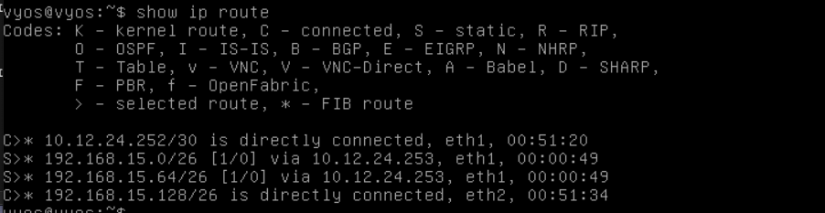

# Documentation for E05

## Goal 

The goal of this assignment was to import, attach and configure Vyos 2 as well as Lubuntu 3. After that, I had to set up DHCP and static routing on both routers. 

## Configurations 

* [Vyos 1](E05/Vyos1.cfg)
* [Vyos 2](E05/Vyos2.cfg)

## Physical topology 


## Logical topology 


## Addresing devices to routers manually 

### **Vyos 1**

```
interfaces {
    ethernet eth0 {
        duplex auto
        hw-id 08:00:27:2d:bd:e9
        smp-affinity auto
        speed auto
        vif 25 {
            address 192.168.15.126/26
            description brave_new_vlan
        }
        vif 40 {
            address 10.12.24.14/28
            description network_devices
        }
        vif 228 {
            address 192.168.15.62/26
            description VLAN228
        }
    }
    ethernet eth1 {
        address 10.12.24.253/30
        description RtoR
        duplex auto
        hw-id 08:00:27:a5:0e:f9
        smp-affinity auto
        speed auto
    }
    loopback lo {
    }
}
```

### **Vyos 2**

```
interfaces {
     ethernet eth1 {
         address 10.12.24.254/30
         description RtoR
         duplex auto
         hw-id 08:00:27:92:20:14
         smp-affinity auto
         speed auto
     }
     ethernet eth2 {
         address 192.168.15.129/26
         description LAN5
         duplex auto
         hw-id 08:00:27:0d:81:5a
         smp-affinity auto
         speed auto
     }
     loopback lo {
     }
 }
```


## Making Vyos a DHCP Server

### **Vyos 1**

### "VLAN228"

```
set service dhcp-server shared-network-name VLAN228 subnet 192.168.15.0/26 default-router 192.168.15.62          
(default gateway command)


set service dhcp-server shared-network-name VLAN228 subnet 192.168.15.0/26 range PCs start 192.168.15.1
(where to start sharing addresses)


set service dhcp-server shared-network-name VLAN228 subnet 192.168.15.0/26 range PCs stop 192.168.15.50	
(where the address allocation is decided)

```

### "brave_new_vlan"


```
set service dhcp-server shared-network-name VLAN25 subnet 192.168.15.64/26 default-router 192.168.15.126  
(default gateway command)


set service dhcp-server shared-network-name VLAN25 subnet 192.168.15.64/26 range PCs start 192.168.15.65  
(where to start sharing addresses)

set service dhcp-server shared-network-name VLAN25 subnet 192.168.15.64/26 range PCs stop 192.168.15.105	
(where the address allocation is decided)

```

### **Results after configuration**

```
service {
    dhcp-server {
        shared-network-name VLAN25 {
            subnet 192.168.15.64/26 {
                default-router 192.168.15.126
                range PCs {
                    start 192.168.15.65
                    stop 192.168.15.105
                }
            }
        }
        shared-network-name VLAN228 {
            subnet 192.168.15.0/26 {
                default-router 192.168.15.62
                range PCs {
                    start 192.168.15.1
                    stop 192.168.15.50
                }
            }
        }
    }
}
```


### **Vyos 2**

### "LAN5"

```
set service dhcp-server shared-network-name LAN5 subnet (192.168.15.128/26) default-router 192.168.15.129    
(default gateway command)


set service dhcp-server shared-network-name LAN5 subnet (192.168.15.128/26)  range PCs start 192.168.15.130
(where to start sharing addresses)


set service dhcp-server shared-network-name LAN5 subnet (192.168.15.128/26)  range PCs stop 192.168.15.180
(where the address allocation is decided)
```

### **Result after configuration**

```
service {
    dhcp-server {
        shared-network-name LAN5 {
            subnet 192.168.15.128/26 {
                default-router 192.168.15.129
                range PCs {
                    start 192.168.15.130
                    stop 192.168.15.180
                }
            }
        }
    }
}
```

## Creating a static route(s) for the Router(s)

### **Vyos 1**

```
protocols {
    static {
        route 192.168.15.128/26 {
            next-hop 10.12.24.254 {
            }
        }
    }
}
```

### **Vyos 2**

```
protocols {
     static {
         route 192.168.15.0/26 {
             next-hop 10.12.24.253 {
             }
         }
         route 192.168.15.64/26 {
             next-hop 10.12.24.253 {
             }
         }
     }
 }
```

## Checking whether devices are addressed correctly

### **`show ip route` on Vyos 1**


### **`show ip route` on Vyos 2**


### **`show dhcp server leases` on Vyos 1**


### **`show dhcp server leases` on Vyos 2**


## Connectivity tests 

### **`traceroute` of the Lubuntu 1**

```
lubuntu@lubuntu-virtualbox:~$ traceroute 192.168.15.2
traceroute to 192.168.15.2 (192.168.15.2), 64 hops max
  1   192.168.15.129  0,786ms  0,312ms  0,274ms 
  2   10.12.24.253  1,090ms  0,689ms  0,864ms 
  3   192.168.15.2  3,070ms  2,576ms  2,894ms 

```

### **`ping` of the Lubuntu 1**

```
lubuntu@lubuntu-virtualbox:~$ ping 192.168.15.2
PING 192.168.15.2 (192.168.15.2) 56(84) bytes of data.
64 bytes from 192.168.15.2: icmp_seq=1 ttl=62 time=3.99 ms
64 bytes from 192.168.15.2: icmp_seq=2 ttl=62 time=2.80 ms
64 bytes from 192.168.15.2: icmp_seq=3 ttl=62 time=3.67 ms
64 bytes from 192.168.15.2: icmp_seq=4 ttl=62 time=2.79 ms
64 bytes from 192.168.15.2: icmp_seq=5 ttl=62 time=3.02 ms
64 bytes from 192.168.15.2: icmp_seq=6 ttl=62 time=2.74 ms
64 bytes from 192.168.15.2: icmp_seq=7 ttl=62 time=2.59 ms
64 bytes from 192.168.15.2: icmp_seq=8 ttl=62 time=3.38 ms
64 bytes from 192.168.15.2: icmp_seq=9 ttl=62 time=3.13 ms
64 bytes from 192.168.15.2: icmp_seq=10 ttl=62 time=3.49 ms
64 bytes from 192.168.15.2: icmp_seq=11 ttl=62 time=2.31 ms
64 bytes from 192.168.15.2: icmp_seq=12 ttl=62 time=3.67 ms
^C
--- 192.168.15.2 ping statistics ---
12 packets transmitted, 12 received, 0% packet loss, time 11025ms
rtt min/avg/max/mdev = 2.306/3.131/3.991/0.489 ms
```

### **`arp -an` of the Lubuntu 1**

```
lubuntu@lubuntu-virtualbox:~$ arp -an
? (192.168.15.62) at 08:00:27:2d:bd:e9 [ether] on enp0s3
```

### **`traceroute` of the Lubuntu 2**

```
lubuntu@lubuntu-virtualbox:~$ traceroute 192.168.15.65
traceroute to 192.168.15.65 (192.168.15.65), 64 hops max
  1   192.168.15.129  0,359ms  0,250ms  0,352ms 
  2   10.12.24.253  1,074ms  0,685ms  0,563ms 
  3   192.168.15.65  2,070ms  1,941ms  1,824ms 
```

### **`ping` of the Lubuntu 2**

```
lubuntu@lubuntu-virtualbox:~$ ping 192.168.15.65
PING 192.168.15.65 (192.168.15.65) 56(84) bytes of data.
64 bytes from 192.168.15.65: icmp_seq=1 ttl=62 time=3.74 ms
64 bytes from 192.168.15.65: icmp_seq=2 ttl=62 time=2.23 ms
64 bytes from 192.168.15.65: icmp_seq=3 ttl=62 time=2.53 ms
64 bytes from 192.168.15.65: icmp_seq=4 ttl=62 time=2.19 ms
64 bytes from 192.168.15.65: icmp_seq=5 ttl=62 time=2.45 ms
64 bytes from 192.168.15.65: icmp_seq=6 ttl=62 time=4.91 ms
64 bytes from 192.168.15.65: icmp_seq=7 ttl=62 time=2.14 ms
64 bytes from 192.168.15.65: icmp_seq=8 ttl=62 time=2.93 ms
64 bytes from 192.168.15.65: icmp_seq=9 ttl=62 time=2.29 ms
64 bytes from 192.168.15.65: icmp_seq=10 ttl=62 time=2.81 ms
64 bytes from 192.168.15.65: icmp_seq=11 ttl=62 time=2.57 ms
64 bytes from 192.168.15.65: icmp_seq=12 ttl=62 time=2.08 ms
^C
--- 192.168.15.65 ping statistics ---
12 packets transmitted, 12 received, 0% packet loss, time 11021ms
rtt min/avg/max/mdev = 2.079/2.738/4.909/0.788 ms
```

### **`arp -an` of the Lubuntu 2**

```
lubuntu@lubuntu-virtualbox:~$ arp -an
? (192.168.15.126) at 08:00:27:2d:bd:e9 [ether] on enp0s3  
```


### **`traceroute` of the Lubuntu 3**

```
lubuntu@lubuntu-virtualbox:~$ traceroute 192.168.15.130
traceroute to 192.168.15.130 (192.168.15.130), 64 hops max
  1   192.168.15.126  0,990ms  0,685ms  0,755ms 
  2   10.12.24.254  1,932ms  1,171ms  1,160ms                                           
  3   192.168.15.130  1,970ms  1,546ms  2,281ms   
```

### **`ping` of the Lubuntu 3**

```
lubuntu@lubuntu-virtualbox:~$ ping 192.168.15.130
PING 192.168.15.130 (192.168.15.130) 56(84) bytes of data.
64 bytes from 192.168.15.130: icmp_seq=1 ttl=62 time=2.15 ms
64 bytes from 192.168.15.130: icmp_seq=2 ttl=62 time=2.76 ms
64 bytes from 192.168.15.130: icmp_seq=3 ttl=62 time=2.32 ms
64 bytes from 192.168.15.130: icmp_seq=4 ttl=62 time=2.27 ms
64 bytes from 192.168.15.130: icmp_seq=5 ttl=62 time=2.31 ms
64 bytes from 192.168.15.130: icmp_seq=6 ttl=62 time=2.75 ms
64 bytes from 192.168.15.130: icmp_seq=7 ttl=62 time=3.10 ms
64 bytes from 192.168.15.130: icmp_seq=8 ttl=62 time=3.02 ms
64 bytes from 192.168.15.130: icmp_seq=9 ttl=62 time=2.12 ms
64 bytes from 192.168.15.130: icmp_seq=10 ttl=62 time=2.46 ms
64 bytes from 192.168.15.130: icmp_seq=11 ttl=62 time=2.33 ms
64 bytes from 192.168.15.130: icmp_seq=12 ttl=62 time=3.05 ms
^C
--- 192.168.15.130 ping statistics ---
12 packets transmitted, 12 received, 0% packet loss, time 11026ms
rtt min/avg/max/mdev = 2.116/2.552/3.102/0.348 ms
```

### **`arp -an` of the Lubuntu 3**

```
lubuntu@lubuntu-virtualbox:~$ arp -an
? (192.168.15.129) at 08:00:27:0d:81:5a [ether] on enp0s3
```
