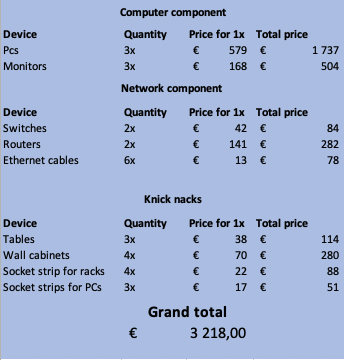
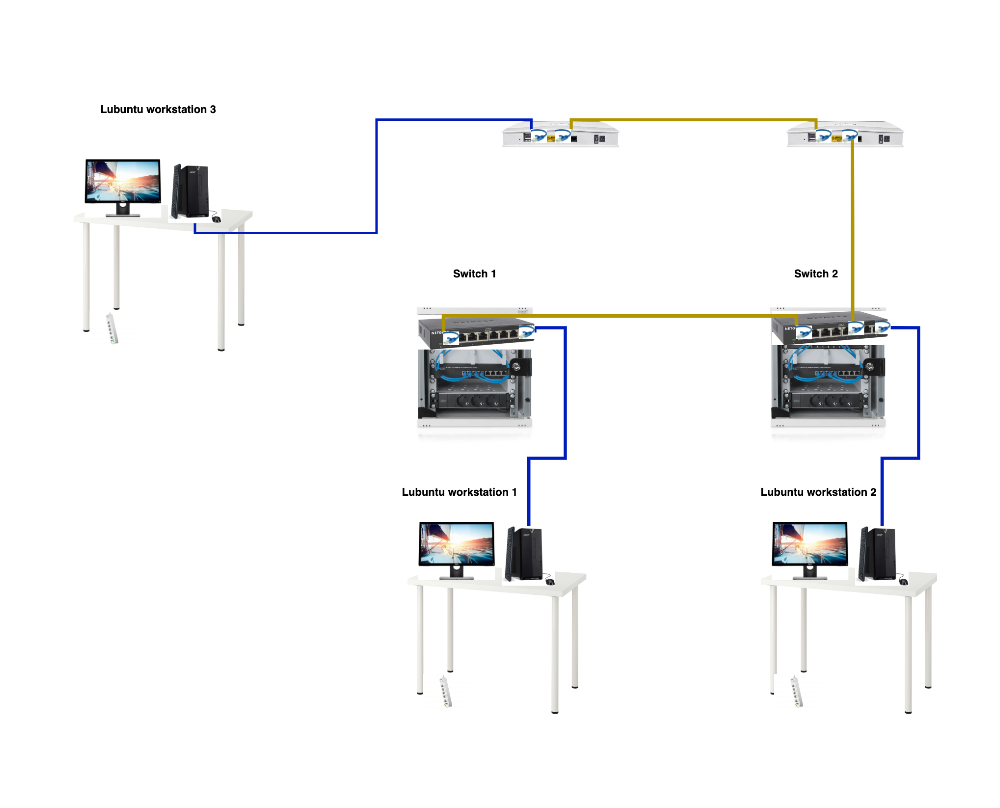

# Documentation for E06

## Goal 

The goal of this assignment was to imagine that all the virtual machines from assignment 5 are actual devices. Thus, I had to make a price list of the whole physical setup and draw a physical topology.

## Price list of the setup I configured 

## Physical topology (contemporary art)

## Devices in my build 
* **PC** : Acer Aspire TC-895-UA92 Desktop, 10th Gen Intel Core i5-10400 6-Core Processor, 12GB 2666MHz DDR4, 512GB NVMe M.2 SSD, 8X DVD, 802.11ax Wi-Fi 6, USB 3.2 Type C, Windows 10 Home
* **Monitor** : Dell Gaming Monitor SE2417HG 23.6" TN LCD Monitor with 2ms Response Time,black
* **Switch** : NETGEAR GS308E 8-port x 10/100/1000 Smart Switch
* **Router** : DrayTek Vigor 2765 VDSL Router
* **Cabling** : Mediabridge Ethernet Cable (25 Feet) - Supports Cat6 / Cat5e / Cat5 Standards, 550MHz, 10Gbps - RJ45 Computer Networking Cord (Part# 31-399-25X)
* **Small rack for the switches** : Digitus 6U 10" Wall Cabinet
