# Documentation for E07

## Physical topology 

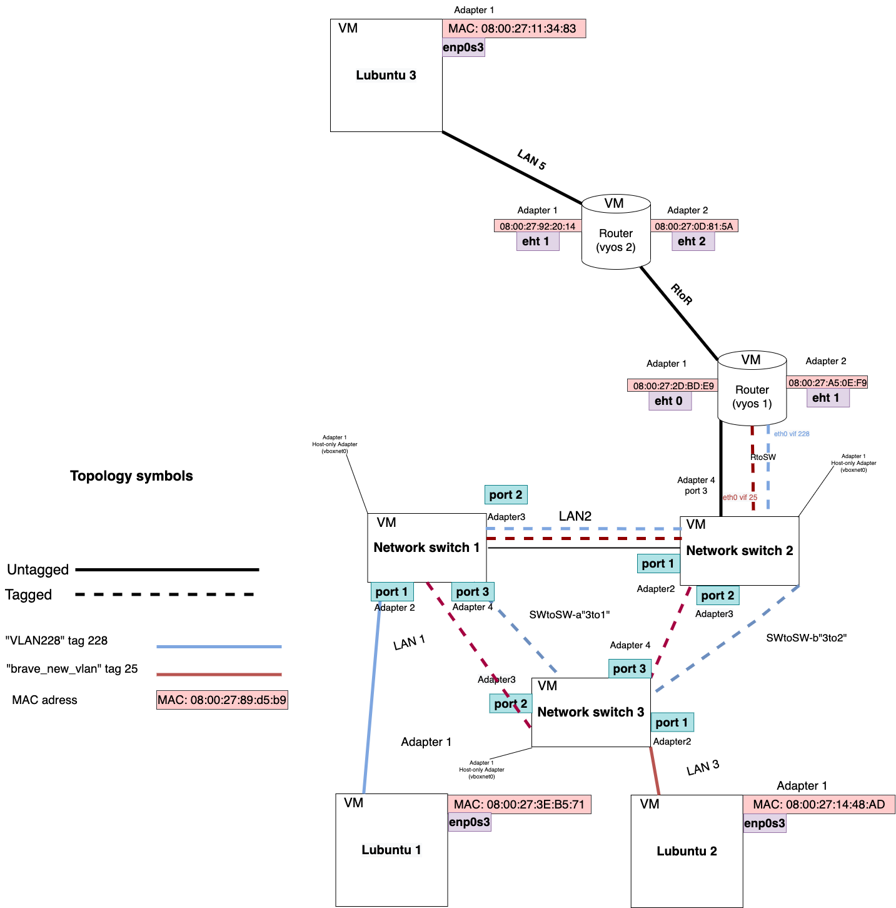

### First of all of all, I cloned switch 2 to make switch 3 from it. Then I changed network settings of the switches.

## Switch 1
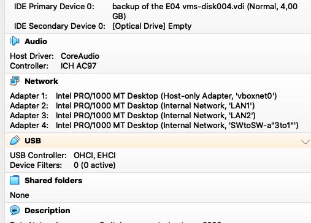

## Switch 2
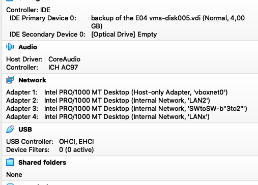

## Switch 3
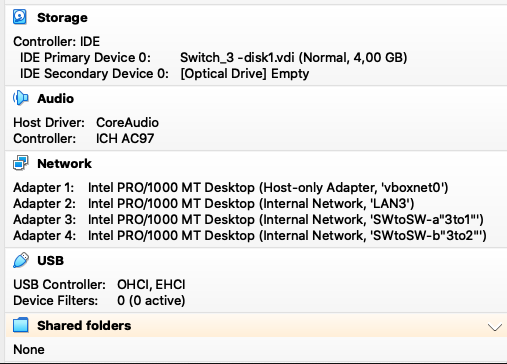

### Second of all, I slightly chnged ports settings in the switches. 

## Switch 1
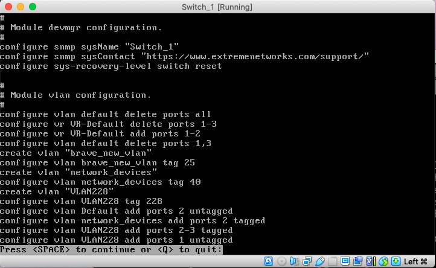

## Switch 2
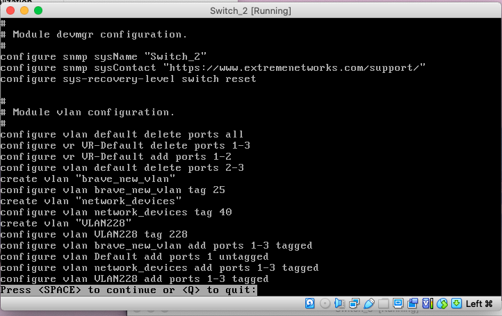

## Switch 3
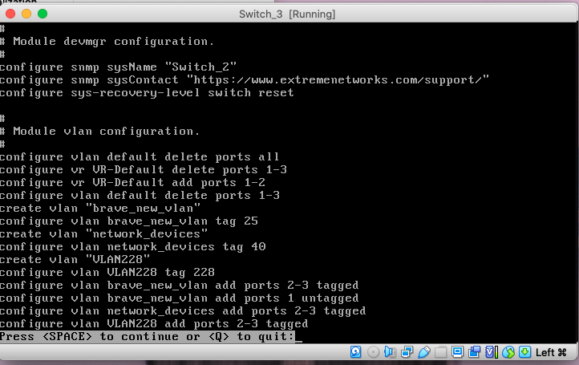


## Lubuntu 1 reaches its default gateway 

```
lubuntu@lubuntu-virtualbox:~$ ip addr
1: lo: <LOOPBACK,UP,LOWER_UP> mtu 65536 qdisc noqueue state UNKNOWN group default qlen 1000
    link/loopback 00:00:00:00:00:00 brd 00:00:00:00:00:00
    inet 127.0.0.1/8 scope host lo
       valid_lft forever preferred_lft forever
    inet6 ::1/128 scope host 
       valid_lft forever preferred_lft forever
2: enp0s3: <BROADCAST,MULTICAST,UP,LOWER_UP> mtu 1500 qdisc fq_codel state UP group default qlen 1000
    link/ether 08:00:27:3e:b5:71 brd ff:ff:ff:ff:ff:ff
    inet 192.168.15.2/26 brd 192.168.15.63 scope global dynamic noprefixroute enp0s3
       valid_lft 85882sec preferred_lft 85882sec
    inet6 fe80::71cd:d51c:49cd:e80b/64 scope link noprefixroute 
       valid_lft forever preferred_lft forever

lubuntu@lubuntu-virtualbox:~$ ip route | grep default
default via 192.168.15.62 dev enp0s3 proto dhcp metric 100 

lubuntu@lubuntu-virtualbox:~$ ping 192.168.15.62
PING 192.168.15.62 (192.168.15.62) 56(84) bytes of data.
64 bytes from 192.168.15.62: icmp_seq=1 ttl=64 time=1.61 ms
64 bytes from 192.168.15.62: icmp_seq=2 ttl=64 time=1.55 ms
64 bytes from 192.168.15.62: icmp_seq=3 ttl=64 time=4.46 ms
64 bytes from 192.168.15.62: icmp_seq=4 ttl=64 time=2.76 ms
64 bytes from 192.168.15.62: icmp_seq=5 ttl=64 time=2.04 ms
64 bytes from 192.168.15.62: icmp_seq=6 ttl=64 time=5.43 ms
64 bytes from 192.168.15.62: icmp_seq=7 ttl=64 time=3.51 ms
64 bytes from 192.168.15.62: icmp_seq=8 ttl=64 time=4.04 ms
^C
--- 192.168.15.62 ping statistics ---
8 packets transmitted, 8 received, 0% packet loss, time 7016ms
rtt min/avg/max/mdev = 1.551/3.176/5.432/1.329 ms
lubuntu@lubuntu-virtualbox:~$ 

```


## Lubuntu 2 reaches its default gateway 

```
lubuntu@lubuntu-virtualbox:~$ ip addr
1: lo: <LOOPBACK,UP,LOWER_UP> mtu 65536 qdisc noqueue state UNKNOWN group default qlen 1000
    link/loopback 00:00:00:00:00:00 brd 00:00:00:00:00:00
    inet 127.0.0.1/8 scope host lo
       valid_lft forever preferred_lft forever
    inet6 ::1/128 scope host 
       valid_lft forever preferred_lft forever
2: enp0s3: <BROADCAST,MULTICAST,UP,LOWER_UP> mtu 1500 qdisc fq_codel state UP group default qlen 1000
    link/ether 08:00:27:14:48:ad brd ff:ff:ff:ff:ff:ff
    inet 192.168.15.65/26 brd 192.168.15.127 scope global dynamic noprefixroute enp0s3
       valid_lft 86273sec preferred_lft 86273sec
    inet6 fe80::71cd:d51c:49cd:e80b/64 scope link noprefixroute 
       valid_lft forever preferred_lft forever

lubuntu@lubuntu-virtualbox:~$ ip route | grep default
default via 192.168.15.126 dev enp0s3 proto dhcp metric 100 

lubuntu@lubuntu-virtualbox:~$ ping 192.168.15.126
PING 192.168.15.126 (192.168.15.126) 56(84) bytes of data.
64 bytes from 192.168.15.126: icmp_seq=1 ttl=64 time=3.06 ms
64 bytes from 192.168.15.126: icmp_seq=2 ttl=64 time=3.10 ms
64 bytes from 192.168.15.126: icmp_seq=3 ttl=64 time=2.35 ms
64 bytes from 192.168.15.126: icmp_seq=4 ttl=64 time=2.52 ms
64 bytes from 192.168.15.126: icmp_seq=5 ttl=64 time=3.18 ms
64 bytes from 192.168.15.126: icmp_seq=6 ttl=64 time=5.27 ms
64 bytes from 192.168.15.126: icmp_seq=7 ttl=64 time=2.19 ms
64 bytes from 192.168.15.126: icmp_seq=8 ttl=64 time=2.92 ms
^C
--- 192.168.15.126 ping statistics ---
8 packets transmitted, 8 received, 0% packet loss, time 7012ms
rtt min/avg/max/mdev = 2.193/3.074/5.267/0.898 ms
lubuntu@lubuntu-virtualbox:~$ 

```

## Looping

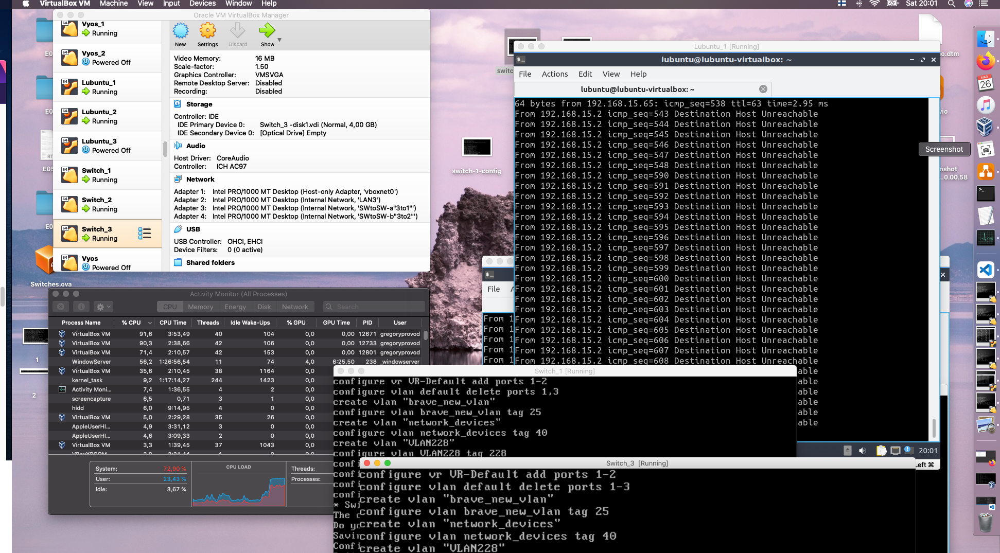


### CPU load 

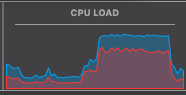 

### Load of the each core 

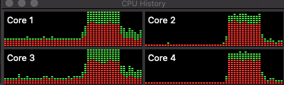 


<br>
<br>

```
show ports statistics
```

## Switch 1
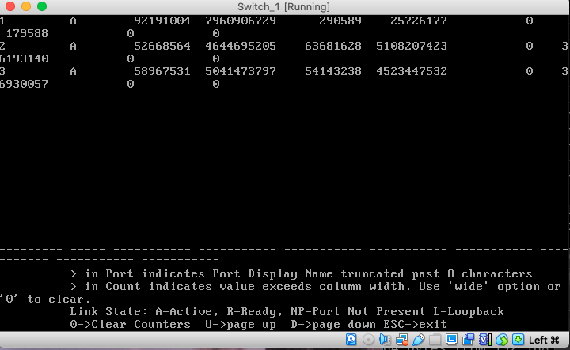

## Switch 2
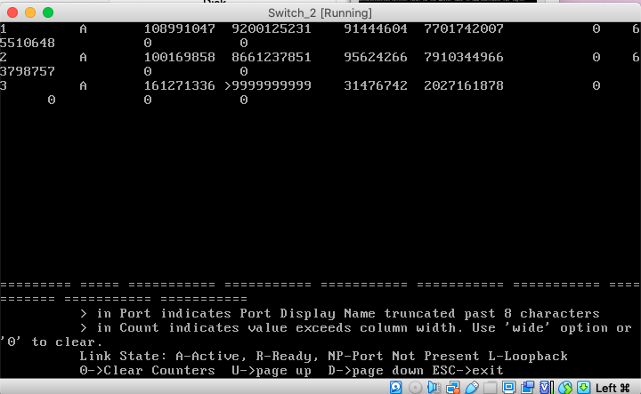

## Switch 3
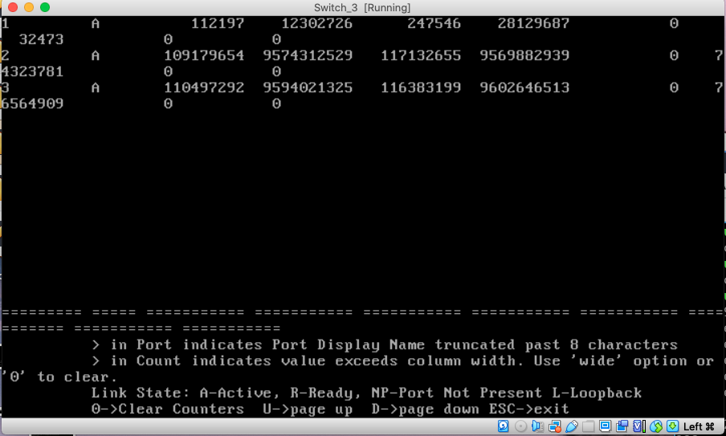


## Enabling STP


## Switch 1
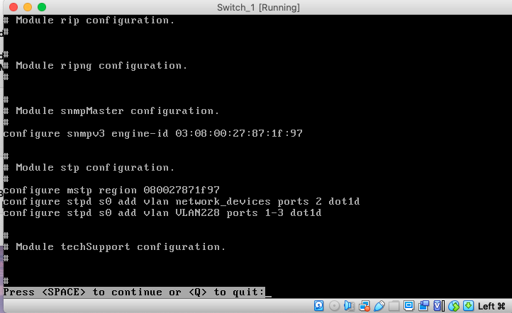

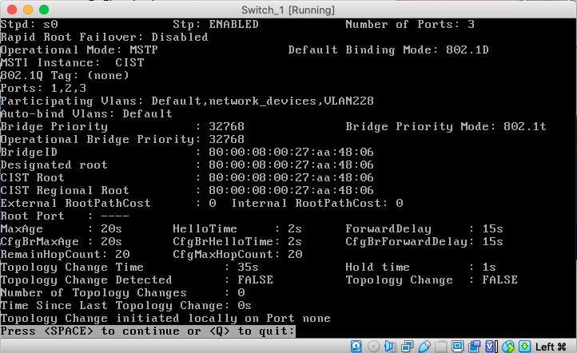

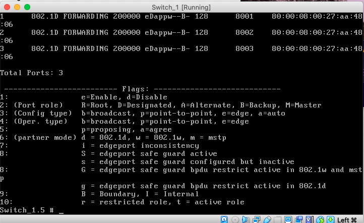

## Switch 2
<br>
<br>

### Personally, I chose Switch 2 to be a root switch 

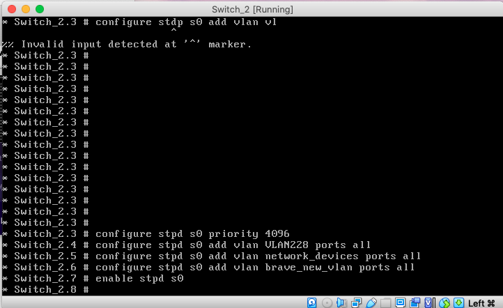

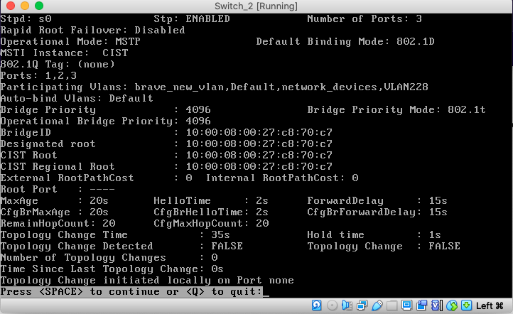

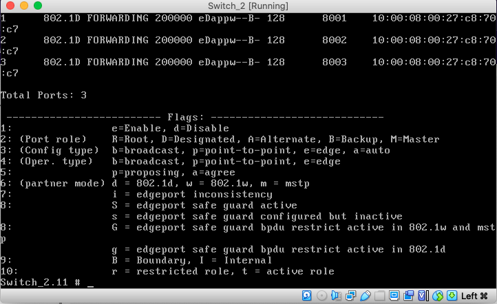

## Switch 3
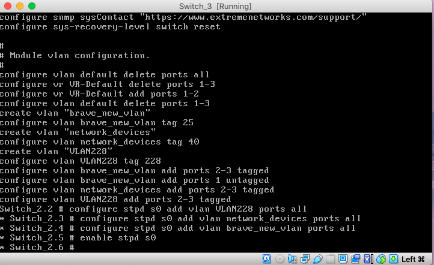

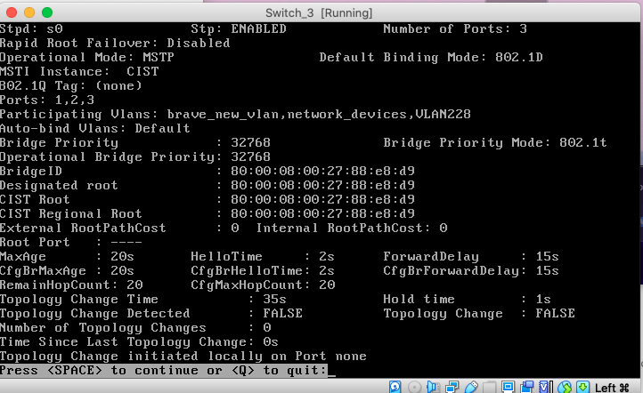

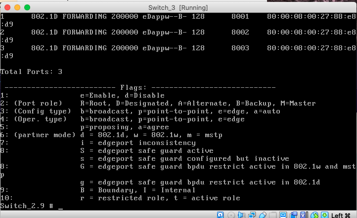


## Measuring changes in topology


<br>

### I disabled and enabled port 1 on the Switch 2 while pinging Lubuntu 2 from Lubuntu 1

```
lubuntu@lubuntu-virtualbox:~$ ping 192.168.15.65
PING 192.168.15.65 (192.168.15.65) 56(84) bytes of data.
64 bytes from 192.168.15.65: icmp_seq=1 ttl=63 time=2.94 ms
64 bytes from 192.168.15.65: icmp_seq=2 ttl=63 time=3.11 ms
64 bytes from 192.168.15.65: icmp_seq=3 ttl=63 time=5.16 ms
64 bytes from 192.168.15.65: icmp_seq=4 ttl=63 time=5.08 ms
64 bytes from 192.168.15.65: icmp_seq=5 ttl=63 time=5.15 ms
64 bytes from 192.168.15.65: icmp_seq=6 ttl=63 time=4.35 ms
64 bytes from 192.168.15.65: icmp_seq=7 ttl=63 time=3.56 ms
64 bytes from 192.168.15.65: icmp_seq=8 ttl=63 time=3.35 ms
64 bytes from 192.168.15.65: icmp_seq=9 ttl=63 time=3.23 ms
64 bytes from 192.168.15.65: icmp_seq=10 ttl=63 time=4.03 ms
------------------------------------------------------------ disabled the port 
64 bytes from 192.168.15.65: icmp_seq=16 ttl=63 time=4.79 ms
64 bytes from 192.168.15.65: icmp_seq=17 ttl=63 time=6.27 ms
64 bytes from 192.168.15.65: icmp_seq=18 ttl=63 time=3.83 ms
64 bytes from 192.168.15.65: icmp_seq=19 ttl=63 time=4.97 ms
64 bytes from 192.168.15.65: icmp_seq=20 ttl=63 time=4.09 ms
64 bytes from 192.168.15.65: icmp_seq=21 ttl=63 time=4.49 ms
64 bytes from 192.168.15.65: icmp_seq=22 ttl=63 time=3.87 ms
64 bytes from 192.168.15.65: icmp_seq=23 ttl=63 time=4.27 ms
------------------------------------------------------------ enabled the port 
64 bytes from 192.168.15.65: icmp_seq=27 ttl=63 time=3.34 ms
64 bytes from 192.168.15.65: icmp_seq=28 ttl=63 time=4.85 ms
64 bytes from 192.168.15.65: icmp_seq=29 ttl=63 time=5.67 ms
64 bytes from 192.168.15.65: icmp_seq=30 ttl=63 time=3.79 ms
64 bytes from 192.168.15.65: icmp_seq=31 ttl=63 time=3.41 ms
64 bytes from 192.168.15.65: icmp_seq=32 ttl=63 time=3.70 ms
64 bytes from 192.168.15.65: icmp_seq=33 ttl=63 time=3.45 ms
64 bytes from 192.168.15.65: icmp_seq=34 ttl=63 time=5.48 ms
^C
--- 192.168.15.65 ping statistics ---
34 packets transmitted, 26 received, 23,5294% packet loss, time 33232ms
rtt min/avg/max/mdev = 2.935/4.239/6.273/0.868 ms
lubuntu@lubuntu-virtualbox:~$ 

```


## Switch 1
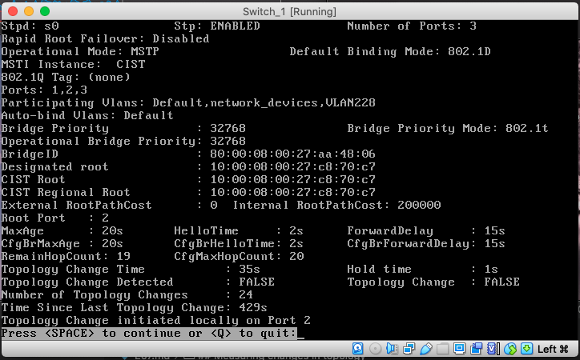

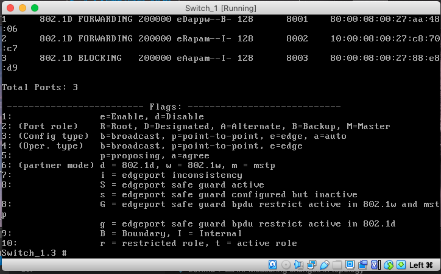

## Switch 2
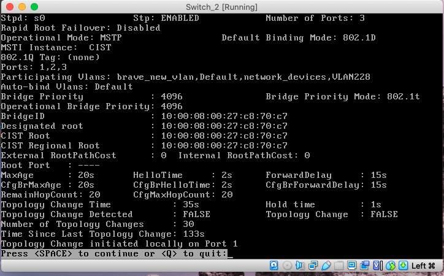

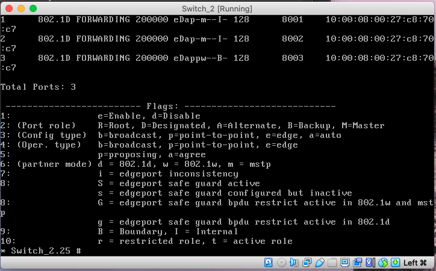

## Switch 3
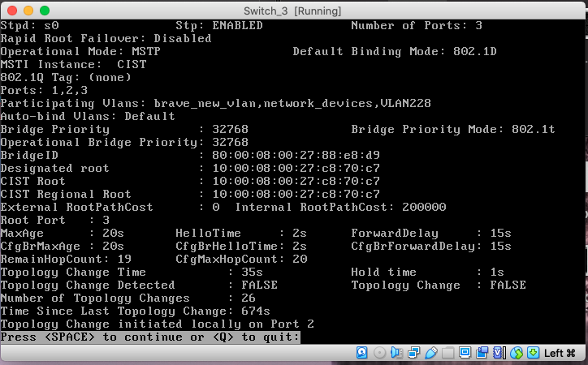

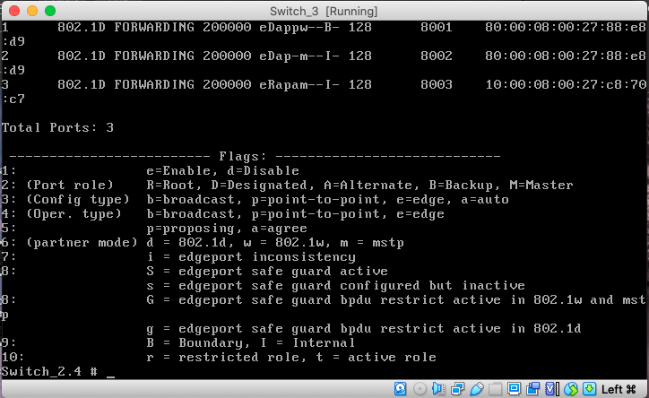