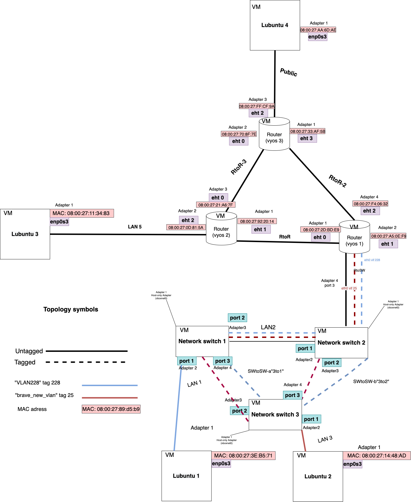
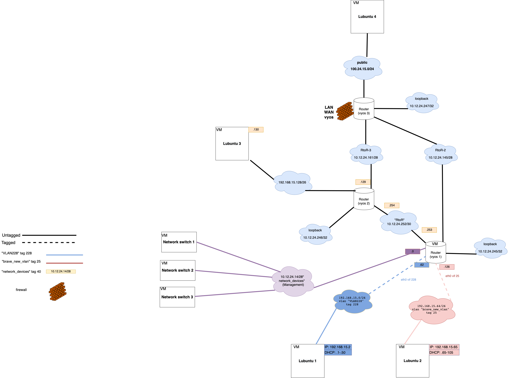
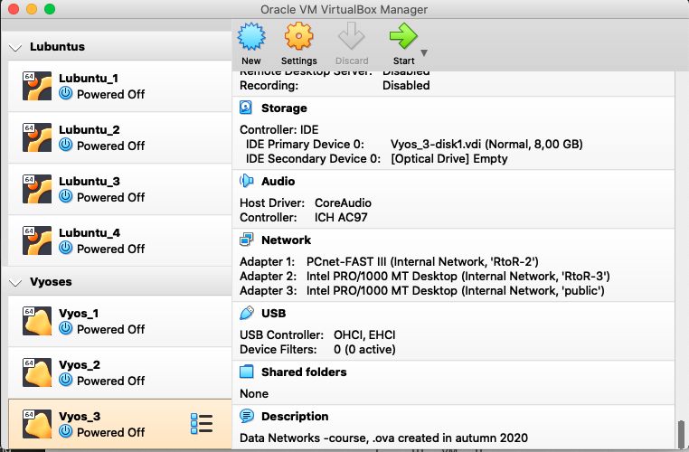
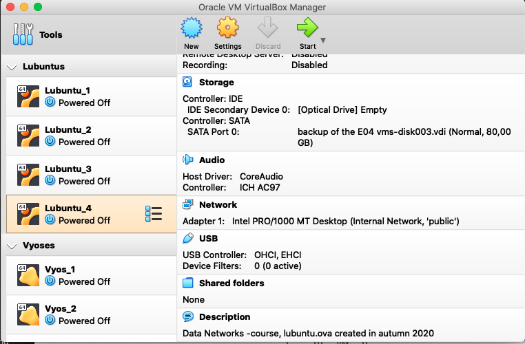
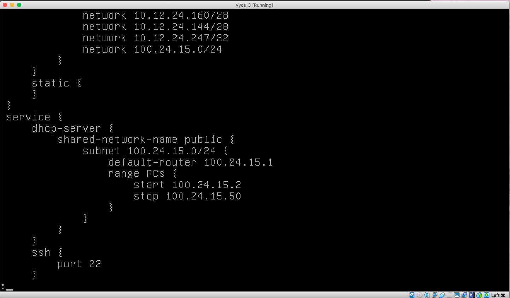
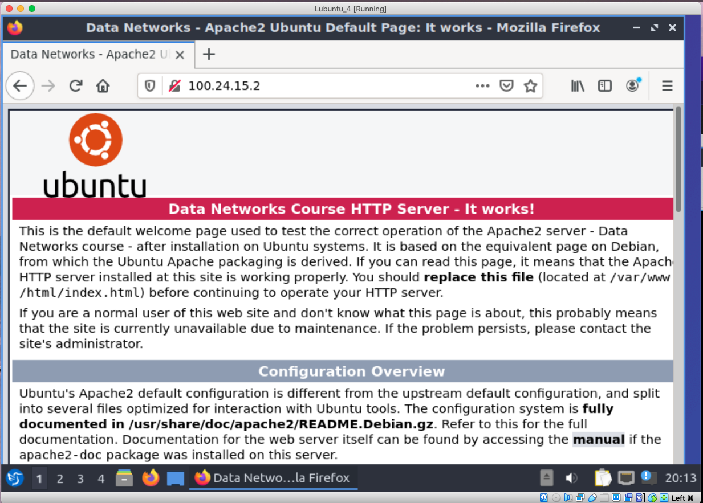
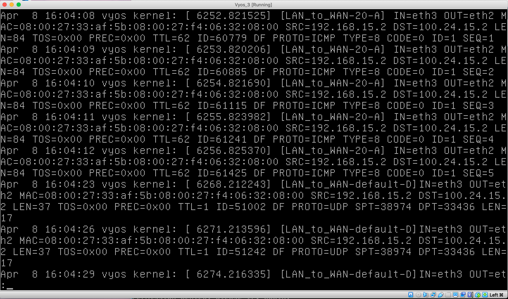

# Documentation for E09

## Goal 

The goal of this assignment was to configure the Firewall on the **Vyos 3** and test it within the untrusted public network.

## Physical topology



## Logical topology

  

## Preparing the topology

### New adapter for **Vyos 3**



### New adapter for **Lubuntu 4**




### New pulblic IPV4 address

```
100.24.15.0/24

This ip is registered to ARIN
```

## Configuring DHCP server on Vyos 3 

```
set interfaces ethernet eth2 address 100.24.15.1/24

set interfaces ethernet eth2 description public 
 
set service dhcp-server shared-network-name public subnet 100.24.15.0/24 default-router 100.24.15.1

set service dhcp-server shared-network-name public subnet 100.24.15.0/24 range PCs start 100.24.15.2

set service dhcp-server shared-network-name public subnet 100.24.15.0/24 range PCs stop 100.24.15.50

set protocols ospf area 0 network 100.24.15.0/24

```

### Configuration of the **Vyos 3** 



## Testing connectivity

### `ping` **Lubuntu 1 --> Lubuntu 4**

```
lubuntu@lubuntu-virtualbox:~$ ping 100.24.15.2
PING 100.24.15.2 (100.24.15.2) 56(84) bytes of data.
64 bytes from 100.24.15.2: icmp_seq=1 ttl=62 time=13.0 ms
64 bytes from 100.24.15.2: icmp_seq=2 ttl=62 time=10.6 ms
64 bytes from 100.24.15.2: icmp_seq=3 ttl=62 time=7.99 ms
64 bytes from 100.24.15.2: icmp_seq=4 ttl=62 time=9.06 ms
64 bytes from 100.24.15.2: icmp_seq=5 ttl=62 time=5.55 ms
^C
--- 100.24.15.2 ping statistics ---
5 packets transmitted, 5 received, 0% packet loss, time 4009ms
rtt min/avg/max/mdev = 5.548/9.247/12.995/2.501 ms
```

### **`traceroute` Lubuntu 1 --> Lubuntu 4**

```
lubuntu@lubuntu-virtualbox:~$ traceroute 100.24.15.2
traceroute to 100.24.15.2 (100.24.15.2), 64 hops max
  1   192.168.15.62  34,460ms  2,195ms  3,044ms 
  2   10.12.24.158  4,646ms  42,662ms  4,155ms 
  3   100.24.15.2  39,232ms  9,163ms  4,220ms 
```


### **`ip addr` on Lubuntu 4**

```
lubuntu@lubuntu-virtualbox:~$ ip addr
1: lo: <LOOPBACK,UP,LOWER_UP> mtu 65536 qdisc noqueue state UNKNOWN group default qlen 1000
    link/loopback 00:00:00:00:00:00 brd 00:00:00:00:00:00
    inet 127.0.0.1/8 scope host lo
       valid_lft forever preferred_lft forever
    inet6 ::1/128 scope host 
       valid_lft forever preferred_lft forever
2: enp0s3: <BROADCAST,MULTICAST,UP,LOWER_UP> mtu 1500 qdisc fq_codel state UP group default qlen 1000
    link/ether 08:00:27:aa:6d:ae brd ff:ff:ff:ff:ff:ff
    inet 100.24.15.2/24 brd 100.24.15.255 scope global dynamic noprefixroute enp0s3
       valid_lft 86365sec preferred_lft 86365sec
    inet6 fe80::71cd:d51c:49cd:e80b/64 scope link noprefixroute 
       valid_lft forever preferred_lft forever


```


## Configuring Firewalls

```
set firewall all-ping enable

set zone-policy zone LAN default-action drop
set zone-policy zone WAN default-action drop
set zone-policy zone vyos default-action drop

set zone-policy zone WAN interface eth2
set zone-policy zone LAN interface eth0
set zone-policy zone LAN interface eth3
set zone-policy zone vyos local-zone

set firewall name LAN_to_WAN default-action drop
set firewall name LAN_to_WAN enable-default-log

set firewall name LAN_to_WAN rule 10 action accept
set firewall name LAN_to_WAN rule 10 destination port 80
set firewall name LAN_to_WAN rule 10 protocol tcp
set firewall name LAN_to_WAN rule 10 log enable

set firewall name LAN_to_WAN rule 11 action accept
set firewall name LAN_to_WAN rule 11 destination port 443
set firewall name LAN_to_WAN rule 11 protocol tcp
set firewall name LAN_to_WAN rule 11 log enable

set firewall name LAN_to_WAN rule 20 action accept
set firewall name LAN_to_WAN rule 20 protocol icmp
set firewall name LAN_to_WAN rule 20 log enable

set firewall name LAN_to_WAN rule 30 action accept
set firewall name LAN_to_WAN rule 30 destination port 22
set firewall name LAN_to_WAN rule 30 protocol tcp
set firewall name LAN_to_WAN rule 30 log enable

set firewall name LAN_to_WAN rule 40 action accept
set firewall name LAN_to_WAN rule 40 destination port 53
set firewall name LAN_to_WAN rule 40 protocol udp
set firewall name LAN_to_WAN rule 40 log enable

set firewall name WAN_to_LAN default-action drop
set firewall name WAN_to_LAN rule 10 action accept
set firewall name WAN_to_LAN rule 10 state established enable
set firewall name WAN_to_LAN rule 10 state related enable

set firewall name LAN_to_vyos default-action drop
set firewall name LAN_to_vyos rule 10 action accept
set firewall name LAN_to_vyos rule 10 destination port 22
set firewall name LAN_to_vyos rule 10 protocol tcp
set firewall name LAN_to_vyos rule 20 action accept
set firewall name LAN_to_vyos rule 20 protocol ospf

set firewall name vyos_to_LAN default-action drop
set firewall name vyos_to_LAN rule 10 action accept
set firewall name vyos_to_LAN rule 10 state established enable
set firewall name vyos_to_LAN rule 10 state related enable
set firewall name vyos_to_LAN rule 20 action accept
set firewall name vyos_to_LAN rule 20 protocol ospf

set firewall name vyos_to_WAN default-action drop
set firewall name vyos_to_WAN rule 10 action accept
set firewall name vyos_to_WAN rule 10 state established enable
set firewall name vyos_to_WAN rule 10 state related enable

set firewall name WAN_to_vyos default-action drop
set firewall name WAN_to_vyos rule 10 action accept
set firewall name WAN_to_vyos rule 10 state established enable
set firewall name WAN_to_vyos rule 10 state related enable
set firewall name WAN_to_vyos rule 20 action accept
set firewall name WAN_to_vyos rule 20 protocol icmp

set zone-policy zone LAN from WAN firewall name WAN_to_LAN
set zone-policy zone WAN from LAN firewall name LAN_to_WAN
set zone-policy zone vyos from LAN firewall name LAN_to_vyos
set zone-policy zone LAN from vyos firewall name vyos_to_LAN
set zone-policy zone WAN from vyos firewall name vyos_to_WAN
set zone-policy zone vyos from WAN firewall name WAN_to_vyos

```

## Testing connectivity ater firewall configuration

### **Lubuntu 1 --> Lubuntu 4** 

```
lubuntu@lubuntu-virtualbox:~$ ping 100.24.15.2
PING 100.24.15.2 (100.24.15.2) 56(84) bytes of data.
64 bytes from 100.24.15.2: icmp_seq=1 ttl=62 time=12.7 ms
64 bytes from 100.24.15.2: icmp_seq=2 ttl=62 time=4.93 ms
64 bytes from 100.24.15.2: icmp_seq=3 ttl=62 time=5.07 ms
64 bytes from 100.24.15.2: icmp_seq=4 ttl=62 time=5.95 ms
64 bytes from 100.24.15.2: icmp_seq=5 ttl=62 time=6.03 ms
^C
--- 100.24.15.2 ping statistics ---
5 packets transmitted, 5 received, 0% packet loss, time 4007ms


rtt min/avg/max/mdev = 4.928/6.931/12.688/2.912 ms
lubuntu@lubuntu-virtualbox:~$ traceroute 100.24.15.2
traceroute to 100.24.15.2 (100.24.15.2), 64 hops max
  1   192.168.15.62  1,483ms  1,105ms  1,266ms 
  2   10.12.24.158  4,008ms  5,308ms  4,873ms 
  3   *  *  * 
  4   *  *  * 
  5   *  *  * 
^C


lubuntu@lubuntu-virtualbox:~$ sudo su
[sudo] password for lubuntu: 
root@lubuntu-virtualbox:/home/lubuntu# cd
root@lubuntu-virtualbox:~# nmap -PO 100.24.15.2
Starting Nmap 7.80 ( https://nmap.org ) at 2022-04-08 19:56 EEST
Nmap scan report for 100.24.15.2
Host is up (0.021s latency).
Not shown: 997 filtered ports
PORT    STATE  SERVICE
22/tcp  closed ssh
80/tcp  open   http
443/tcp closed https


Nmap done: 1 IP address (1 host up) scanned in 4.58 seconds
root@lubuntu-virtualbox:~# traceroute -M icmp 100.24.15.2
traceroute to 100.24.15.2 (100.24.15.2), 64 hops max
  1   192.168.15.62  1,783ms  1,743ms  2,539ms 
  2   10.12.24.158  3,591ms  2,751ms  3,461ms 
  3   100.24.15.2  3,584ms  3,767ms  4,203ms 


root@lubuntu-virtualbox:~# traceroute -m 100.24.15.2
traceroute: invalid hops value `100.24.15.2'
root@lubuntu-virtualbox:~# traceroute -m 5 100.24.15.2
traceroute to 100.24.15.2 (100.24.15.2), 5 hops max
  1   192.168.15.62  5,805ms  1,420ms  1,612ms 
  2   10.12.24.158  2,572ms  3,275ms  4,320ms 
  3   *  *  * 
  4   *  *  * 
  5   *  *  * 
root@lubuntu-virtualbox:~# 


apache2.service - The Apache HTTP Server
     Loaded: loaded (/lib/systemd/system/apache2.service; enabled; vendor preset: enabled)
     Active: active (running) since Fri 2022-04-08 19:50:55 EEST; 23min ago
       Docs: https://httpd.apache.org/docs/2.4/
    Process: 585 ExecStart=/usr/sbin/apachectl start (code=exited, status=0/SUCCESS)
   Main PID: 634 (apache2)
      Tasks: 55 (limit: 1070)
     Memory: 7.8M
     CGroup: /system.slice/apache2.service
             ├─634 /usr/sbin/apache2 -k start
             ├─636 /usr/sbin/apache2 -k start
             └─637 /usr/sbin/apache2 -k start

huhti 08 19:50:54 lubuntu-virtualbox systemd[1]: Starting The Apache HTTP Server...
huhti 08 19:50:55 lubuntu-virtualbox apachectl[614]: AH00558: apache2: Could not reliably determin>
huhti 08 19:50:55 lubuntu-virtualbox systemd[1]: Started The Apache HTTP Server.

```
## HTTP Server




```
show log firewall name LAN_to_WAN
```


