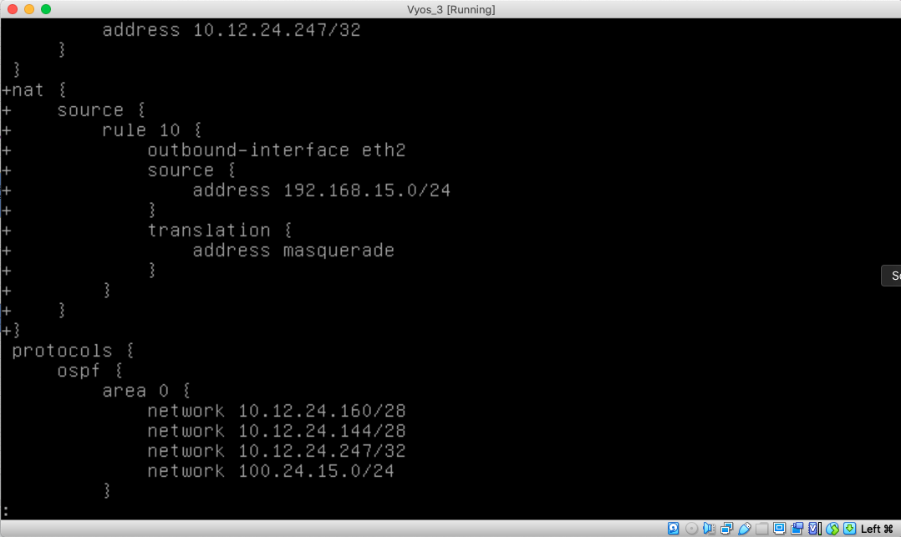
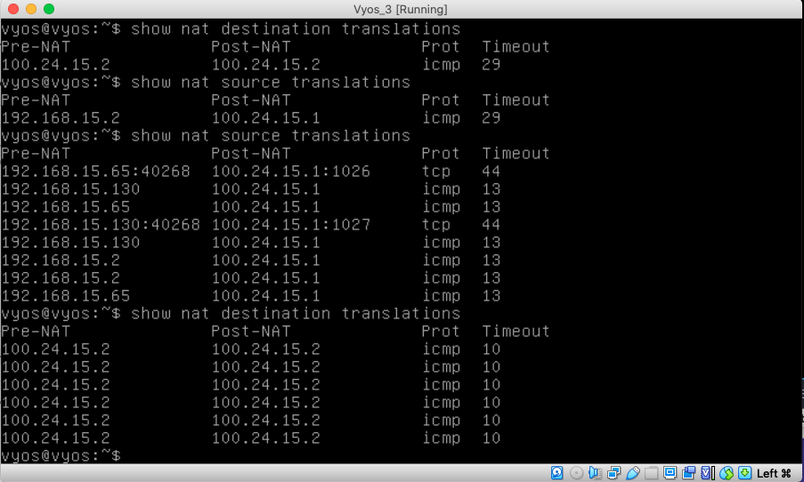
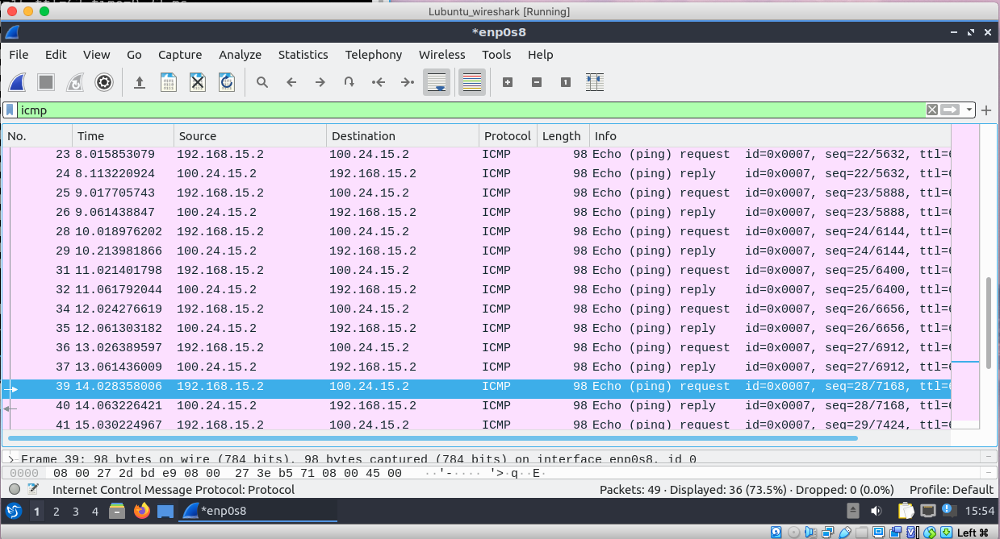
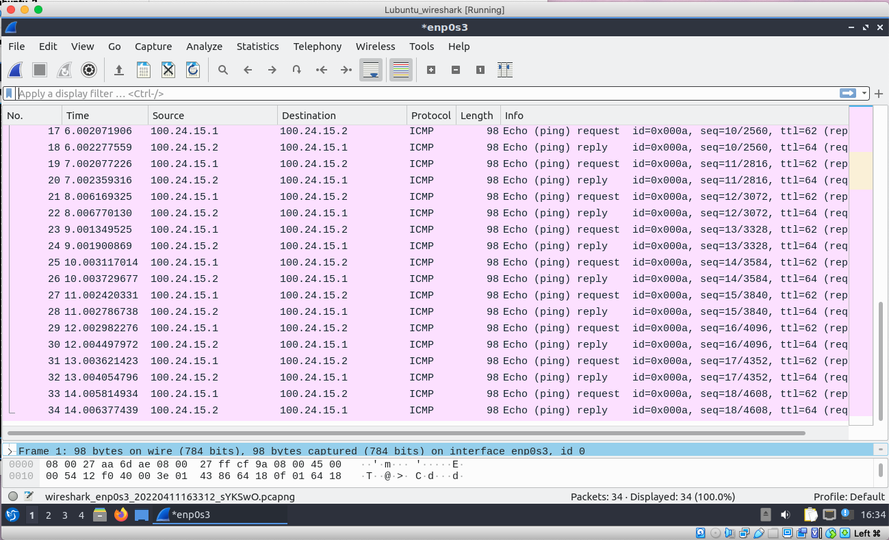

# Documentation for E10

# Configuring Many-to-1 NAT

## I decided to configure NAT without removing firewall

```
set nat source rule 10 outbound-interface eth2
set nat source rule 10 translation address masquerade
```

```
set nat source rule 10 source address 192.168.15.0/24
```

## NAT config on Vyos 3



# Investigating traffic


## nmap from Lubuntu 1,2,3 --> Lubuntu 4

```
root@lubuntu-virtualbox:~# nmap -D 192.168.15.2,192.168.15.65,192.168.15.130 100.24.15.2
Starting Nmap 7.80 ( https://nmap.org ) at 2022-04-11 15:39 EEST
Nmap scan report for 100.24.15.2
Host is up (0.0057s latency).
Not shown: 997 filtered ports
PORT    STATE  SERVICE
22/tcp  closed ssh
80/tcp  open   http
443/tcp closed https
```


## Using show commands after nmapping 

```
show nat source translations
```

```
show nat destination translations 
```





## I cloned lubuntu 4 and turned it into the wireshark machine


## To check if the nat configuration is working I have pinged Lubuntu 4 from Lubuntu 1 while wiresharking public and LAN1 (one at a time)

## Lubuntu 1 --> Lubuntu 4 (Wireshark connected to LAN1)



## Lubuntu 1 --> Lubuntu 4 (Wireshark connected to public)

