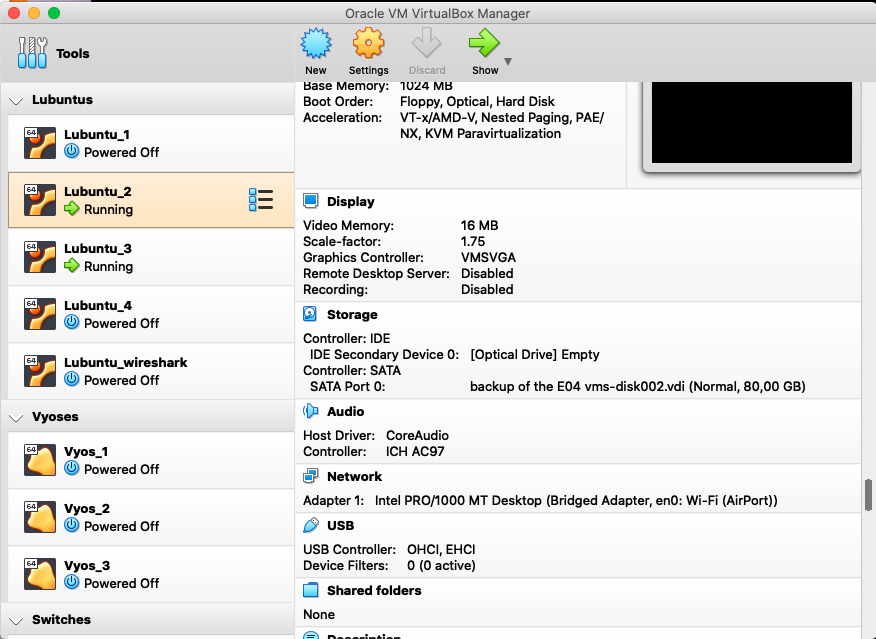
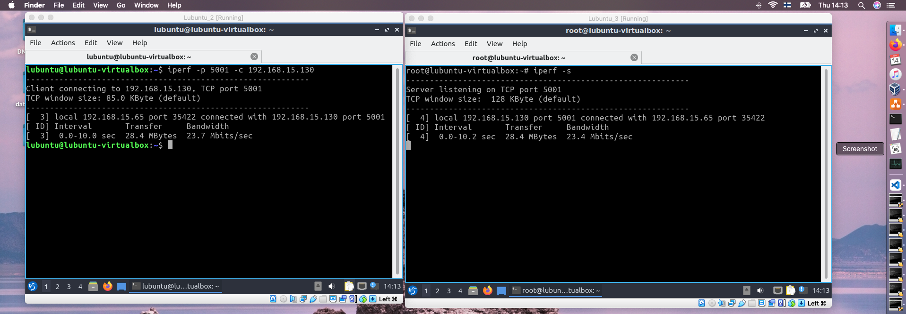
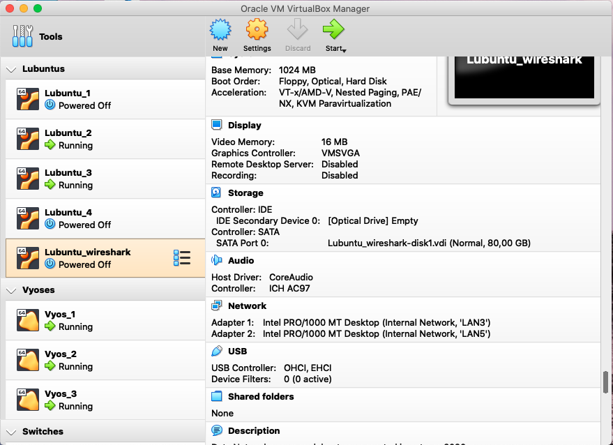
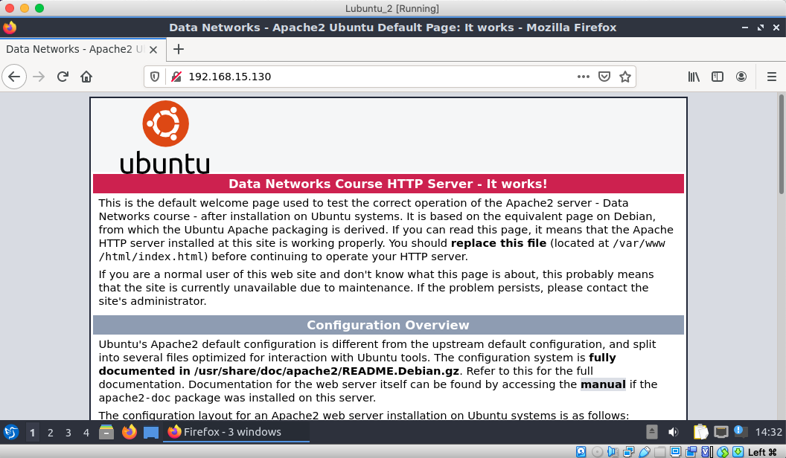
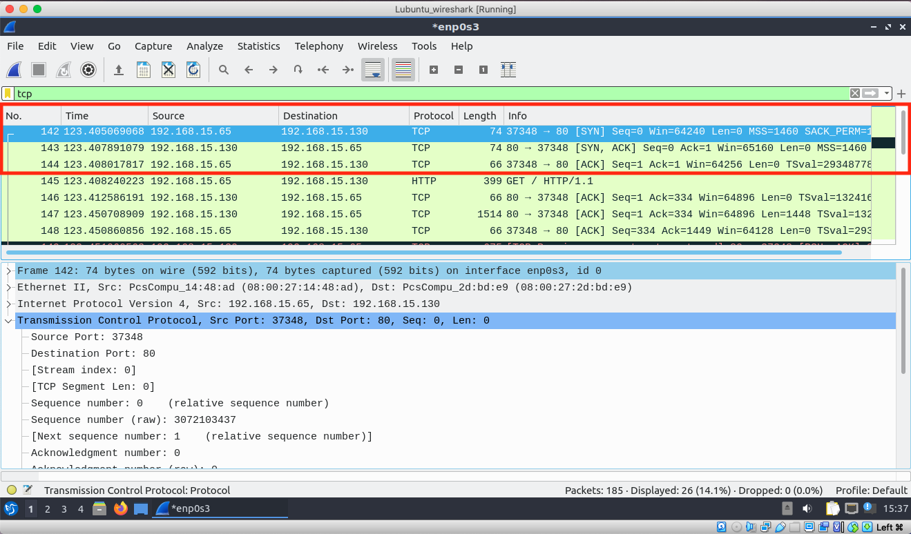
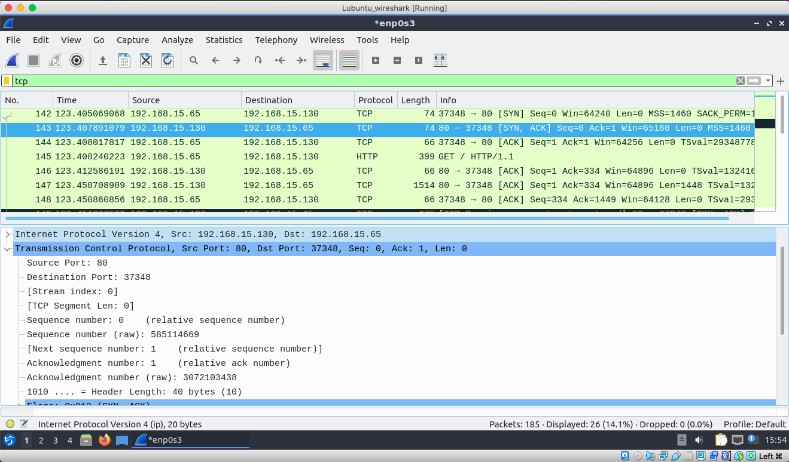
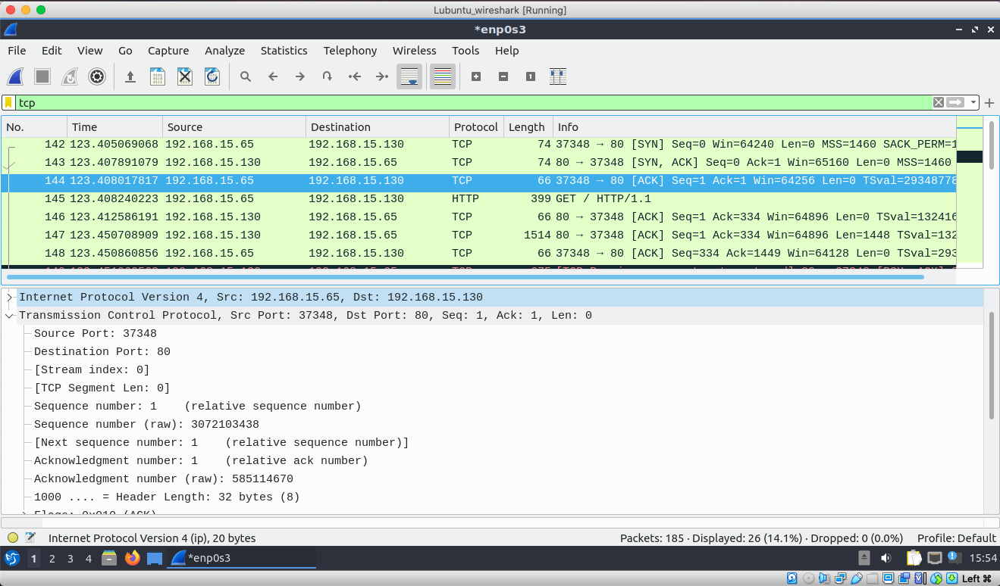
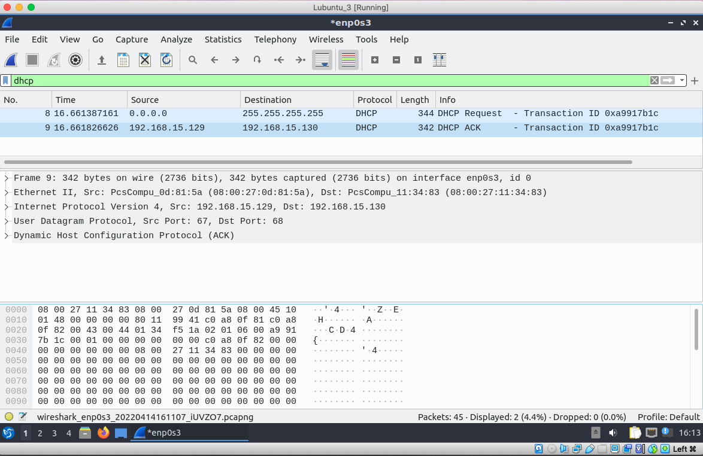

# Documentation for E11

## Goal 

The goal of this assignment was to get familiar with iperf commands and execute them in two different environments: home to internet, within the network. Moreover, I ran multiple tests to investigate TCP/UDP connections.  

## **`iperf`**

## Test from home to Internet

### I have changed the internal network of the Lubuntu 2 (LAN3) to the bridged network thus Lubuntu 2 is now connected to the internet. 



```
iperf -c iperf.he.net
```

```
lubuntu@lubuntu-virtualbox:~$ iperf -c iperf.he.net
------------------------------------------------------------
Client connecting to iperf.he.net, TCP port 5001
TCP window size: 85.0 KByte (default)
------------------------------------------------------------
[  3] local 192.168.1.105 port 39496 connected with 216.218.207.42 port 5001
[ ID] Interval       Transfer     Bandwidth
[  3]  0.0-10.2 sec  71.8 MBytes  59.1 Mbits/sec
```


```
iperf -u -c iperf.he.net
```


```
lubuntu@lubuntu-virtualbox:~$ iperf -u -c iperf.he.net
------------------------------------------------------------
Client connecting to iperf.he.net, UDP port 5001
Sending 1470 byte datagrams, IPG target: 11215.21 us (kalman adjust)
UDP buffer size:  208 KByte (default)
------------------------------------------------------------
[  3] local 192.168.1.105 port 57898 connected with 216.218.207.42 port 5001
[ ID] Interval       Transfer     Bandwidth
[  3]  0.0-10.0 sec  1.25 MBytes  1.05 Mbits/sec
[  3] Sent 892 datagrams
[  3] Server Report:
[  3]  0.0-10.0 sec  1.25 MBytes  1.05 Mbits/sec   0.000 ms 2147481864/2147482756 (1e+02%)
```


## Test within my exercise network

### I will use Lubuntu 3 as a server and Lubuntu 2 as a client. Nevertheless, I will also use Lubuntu Wireshark from the previous exercise but with another adapters 

### **Set up the server on the Lubuntu 3**

```
root@lubuntu-virtualbox:~# iperf -s 
------------------------------------------------------------
Server listening on TCP port 5001
TCP window size:  128 KByte (default)
------------------------------------------------------------
```

### **Connecting clinet (Lubuntu 2) to the server (Lubuntu 3)**




### **Additional client command** 
```
lubuntu@lubuntu-virtualbox:~$ iperf -u -p 5001 -c 192.168.15.130
------------------------------------------------------------
Client connecting to 192.168.15.130, UDP port 5001
Sending 1470 byte datagrams, IPG target: 11215.21 us (kalman adjust)
UDP buffer size:  208 KByte (default)
------------------------------------------------------------
[  3] local 192.168.15.65 port 38270 connected with 192.168.15.130 port 5001
read failed: Connection refused
[  3] WARNING: did not receive ack of last datagram after 2 tries.
[ ID] Interval       Transfer     Bandwidth
[  3]  0.0-10.0 sec  1.25 MBytes  1.05 Mbits/sec
[  3] Sent 892 datagrams
```

## Investigating TCP/UDP connections

### **Wireshark a three-way-handshake between Lubuntu's**

### Setting up Wireshark environment 



### **Lubuntu 2 --> Lubuntu 3 Apache server test** 




## Three way handshake

### SYN --- relative sequence number 0



### SYN, ACK --- relative sequence number 0



### ACK --- relative sequence number 1



## Wireshark a DHCP process between Lubuntu & Vyos



### Here we can see that DHCP request went through while the new .129 IP has been gained (original ip is .130) 