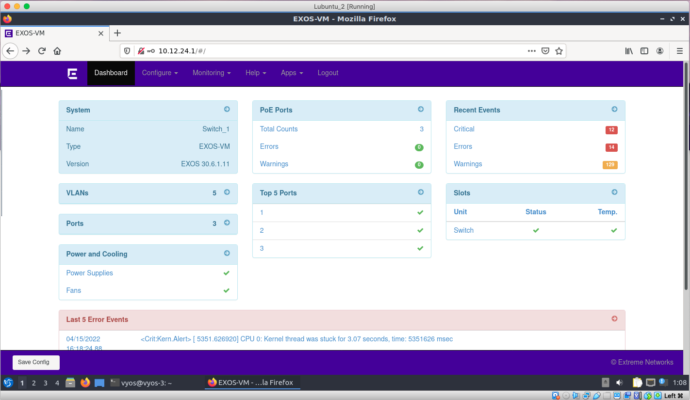

# Documentation for E12


## Configuration files

* [Switch 1](E12/Switch-1.cfg)
* [Switch 2](E12/Switch-2.cfg)
* [Switch 3](E12/Switch-3.cfg)
* [Vyos 1](E12/vyos-1.cfg)
* [Vyos 2](E12/vyos-2.cfg)
* [Vyos 3](E12/vyos-3.cfg)


## Test the HTTP support of the `vyos.ova` and `switch.ova`

### I used Switch 1 an Vyos 1 as web http(s) services and Lubuntu 2 for connecting to these GUIs

## Switch 1



### Web interface of the Switch: you can see logs, warnings, errors, statistics. Speaking of ports and vlans, you can see their current status and modify or edit them. Overall, this interface looks pretty user-friendly and useful.

## Web access is enabled on the port 80

```
Switch_1.1 # show switch management 
CLI idle timeout                 : Enabled (20 minutes)
CLI max number of login attempts : 3
CLI max number of sessions       : 8
CLI paging                       : Enabled
CLI space-completion             : Disabled (this session only)
CLI configuration logging        : Disabled (without expansion)
CLI journal size                 : 100
CLI password prompting only      : Disabled
CLI display moved-keywords       : Hidden
CLI moved-keywords hidden release: 30.6
CLI RADIUS cmd authorize tokens  : 2
CLI scripting                    : Disabled (this session only)
CLI scripting error mode         : Ignore-Error (this session only)
CLI persistent mode              : Persistent (this session only)
CLI prompting                    : Enabled (this session only)
CLI screen size                  : 32 Lines 139 Columns (this session only)
CLI refresh                      : Enabled
CLI history expansion            : Disabled
Current system port notation     : port
Configured system port notation  : port
Telnet access                    : Disabled (tcp port 23 vr all)
                                 : Access Profile : not set
SSH access                       : Enabled (Key valid, tcp port 22 vr all)
                                 : Secure-Mode    : Off
                                 : Access Profile : not set
SSH2 idle time                   : 60 minutes
SSH2 rekey interval              : 4096 MB and no time limit
Web access                       : Enabled (tcp port 80)
                                 : Access Profile : not set
Total Read Only Communities      : 0
Total Read Write Communities     : 0
RMON                             : Disabled
SNMP access                      : Disabled
                                 : Access Profile : not set
SNMP Notifications               : Enabled
SNMP Notification Receivers  : None
SNMP stats:     InPkts 0       OutPkts   0       Errors 0       AuthErrors 0
                Gets   0       GetNexts  0       Sets   0       Drops      0       
SNMP traps:     Sent   0       AuthTraps Enabled
SNMP inform:    Sent   0       Retries   0       Failed 0
```

## Vyos 1 


### Web interface of the Vyos: completelly useless. It seems that developers started the work on the GUI but did not add any working elements yet. 

## Config process of the HTTP on the vyos
```
vyos@vyos-1:~$ config
[edit]
vyos@vyos-1# set service https listen-address 10.12.24.245
[edit]
vyos@vyos-1# commit
[ service https ]
Generating a 2048 bit RSA private key
..........................................................+++
......+++
writing new private key to '/etc/lighttpd/server.pem'
-----

[ service https ]
Restarting vyatta-webgui-chunker (via systemctl): vyatta-webgui-chunker.service.                                                           
                                                                                                                                           
[edit]                                                                                                                                     
vyos@vyos-1#        
```

## Config itself 
```
https {
         listen-address 10.12.24.245

```