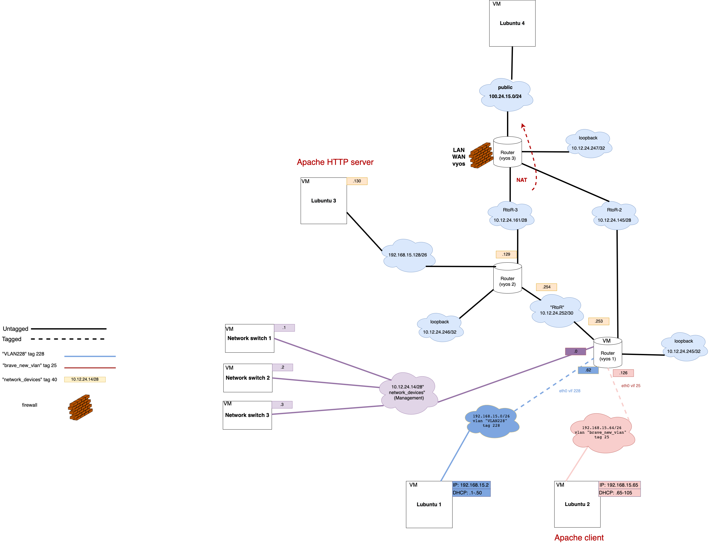
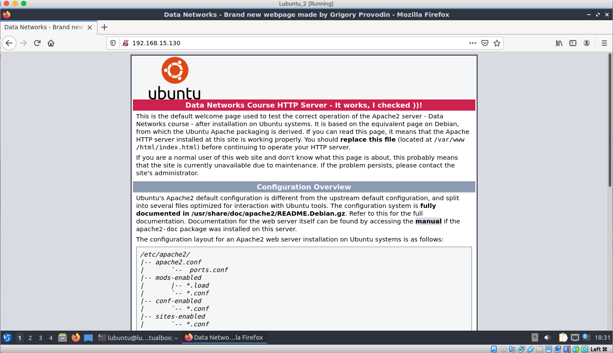
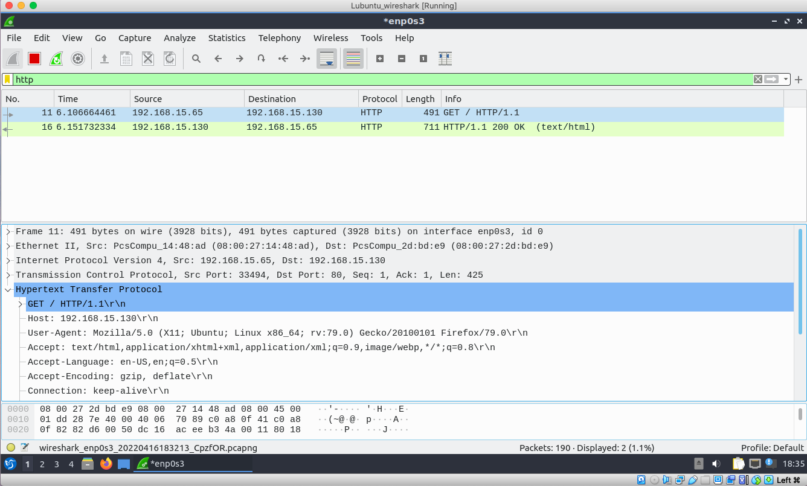

# Documentation for E13

## Goal 

The goal of this assignment was to use one VM as an Apache server while the other as the client, update the .html file on the server, and check the connectivity with Wireshark. 

## Logical topology 


## Verifying Lubuntu - Apache instance

### In this assignment **Lubuntu 3** is the server and **Lubuntu 2** is the client.

### **`service apache2 status` on Lubuntu 3**

```
lubuntu@lubuntu-virtualbox:~$ service apache2 status
● apache2.service - The Apache HTTP Server
     Loaded: loaded (/lib/systemd/system/apache2.service; enabled; vendor preset: enabled)
     Active: active (running) since Sat 2022-04-16 17:30:13 EEST; 7min ago
       Docs: https://httpd.apache.org/docs/2.4/
    Process: 607 ExecStart=/usr/sbin/apachectl start (code=exited, status=0/SUCCESS)
   Main PID: 661 (apache2)
      Tasks: 55 (limit: 1070)
     Memory: 7.7M
     CGroup: /system.slice/apache2.service
             ├─661 /usr/sbin/apache2 -k start
             ├─662 /usr/sbin/apache2 -k start
             └─663 /usr/sbin/apache2 -k start

huhti 16 17:30:11 lubuntu-virtualbox systemd[1]: Starting The Apache HTTP Server...
huhti 16 17:30:13 lubuntu-virtualbox apachectl[636]: AH00558: apache2: Could not reliably determine the server's f>
huhti 16 17:30:13 lubuntu-virtualbox systemd[1]: Started The Apache HTTP Server.
lines 1-16/16 (END)
```

### **`wget` on Lubuntu 3**
```
lubuntu@lubuntu-virtualbox:~$ wget http://127.0.0.1/
--2022-04-16 17:42:24--  http://127.0.0.1/
Connecting to 127.0.0.1:80... connected.
HTTP request sent, awaiting response... 200 OK
Length: 11010 (11K) [text/html]
Saving to: ‘index.html’

index.html                   100%[=============================================>]  10,75K  --.-KB/s    in 0s      

2022-04-16 17:42:24 (283 MB/s) - ‘index.html’ saved [11010/11010]
```

### The retrieved `index.html` file is a design of the apache server webpage that shows up if the apache server is active. One can modify this file. 

```
lubuntu@lubuntu-virtualbox:~$ more index.html 

<!DOCTYPE html PUBLIC "-//W3C//DTD XHTML 1.0 Transitional//EN" "http://www.w3.org/TR/xhtml1/DTD/xhtml1-transitional
.dtd">
<html xmlns="http://www.w3.org/1999/xhtml">
  <!--
    Modified from the Debian original for Ubuntu
    Last updated: 2016-11-16
    See: https://launchpad.net/bugs/1288690
  -->
  <head>
    <meta http-equiv="Content-Type" content="text/html; charset=UTF-8" />
    <title>Data Networks - Apache2 Ubuntu Default Page: It works</title>
    <style type="text/css" media="screen">
  * {
    margin: 0px 0px 0px 0px;
    padding: 0px 0px 0px 0px;
  }

  body, html {
    padding: 3px 3px 3px 3px;

    background-color: #D8DBE2;

    font-family: Verdana, sans-serif;
    font-size: 11pt;
    text-align: center;
  }

  div.main_page {
    position: relative;
    display: table;

    width: 800px;

    margin-bottom: 3px;
    margin-left: auto;
    margin-right: auto;
    padding: 0px 0px 0px 0px;

    border-width: 2px;
    border-color: #212738;
    border-style: solid;

    background-color: #FFFFFF;

    text-align: center;
  }

  div.page_header {
    height: 99px;
    width: 100%;

    background-color: #F5F6F7;
  }

  div.page_header span {
    margin: 15px 0px 0px 50px;

    font-size: 180%;
    font-weight: bold;
  }

  div.page_header img {
    margin: 3px 0px 0px 40px;

    border: 0px 0px 0px;
  }

  div.table_of_contents {
    clear: left;

    min-width: 200px;

    margin: 3px 3px 3px 3px;

    background-color: #FFFFFF;

    text-align: left;
  }

  div.table_of_contents_item {
    clear: left;

    width: 100%;

    margin: 4px 0px 0px 0px;

    background-color: #FFFFFF;

    color: #000000;
    text-align: left;
  }

  div.table_of_contents_item a {
    margin: 6px 0px 0px 6px;
  }

  div.content_section {
    margin: 3px 3px 3px 3px;

    background-color: #FFFFFF;

    text-align: left;
  }

  div.content_section_text {
    padding: 4px 8px 4px 8px;

    color: #000000;
    font-size: 100%;
  }

  div.content_section_text pre {
    margin: 8px 0px 8px 0px;
    padding: 8px 8px 8px 8px;

    border-width: 1px;
    border-style: dotted;
    border-color: #000000;

    background-color: #F5F6F7;
```

## Modifying HTML files on the server



## Wireshark HTTP GET



### User-agent shows the operating system, processor, language, and encoding of the browser.