# Documentation for E14

> I did option 1: "Bridging Ethernet to WLAN basestation"
## Logical topology 

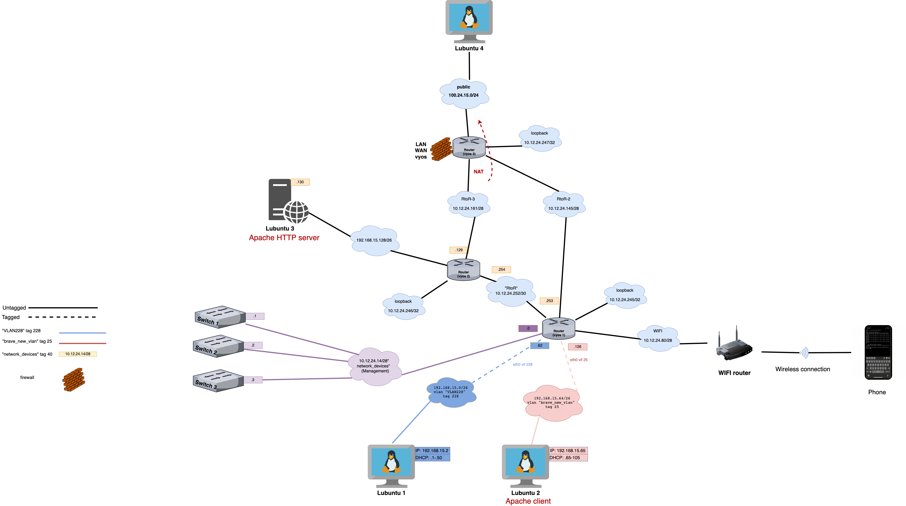

## Physical topology 

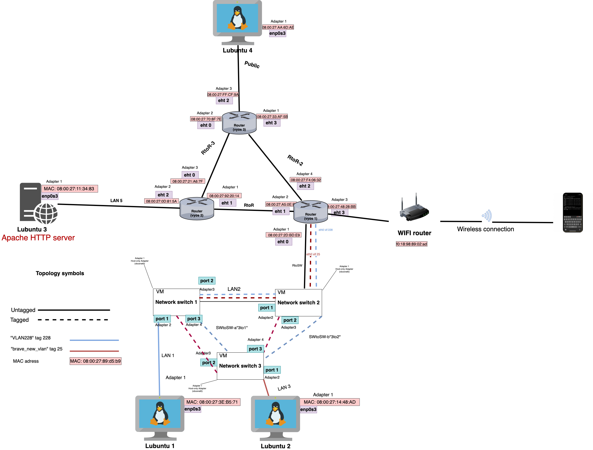


## `Vyos 1` config

[Vyos 1](E14/vyos-1.cfg)


### I will use sixth subnet from the third assignment for configuring IP address. 


| Specification                          | Subnet info     |
|----------------------------------------|-----------------|
| New subnet mask                        | 255.255.255.240 |
| Number of usable hosts in the subnet 	 | 13              |
| Network address                        | 10.12.24.80/28  |
| First IP Host address                  | 10.12.24.81     |
| Last IP Host address                   | 10.12.24.94     |
| Broadcast address                      | 10.12.24.95     |


## Configuring `Vyos 1`

```
set interfaces ethernet eth3 address 10.12.24.81/28

set interfaces ethernet eth3 description WIFI
 
set service dhcp-server shared-network-name WIFI subnet 10.12.24.80/28 default-router 10.12.24.81

set service dhcp-server shared-network-name WIFI subnet 10.12.24.80/28 range PCs start 10.12.24.82

set service dhcp-server shared-network-name WIFI subnet 10.12.24.80/28 range PCs stop 10.12.24.94

set protocols ospf area 0 network 10.12.24.80/28
```

## Network settings of the laptop after configuration

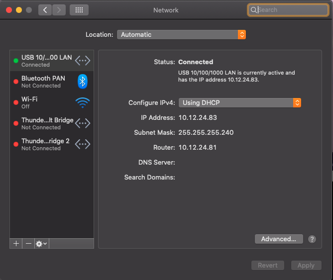


## Phone --> Lubuntu 1


```
ping
```

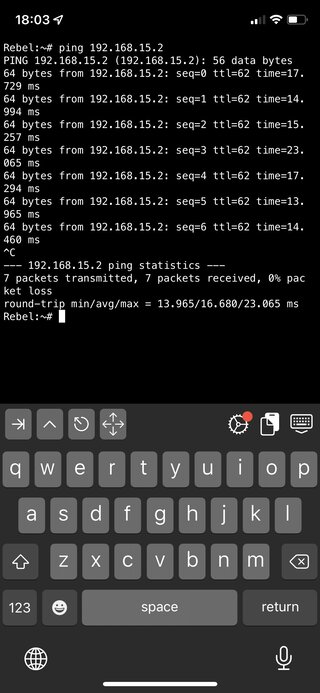


```
traceroute
```
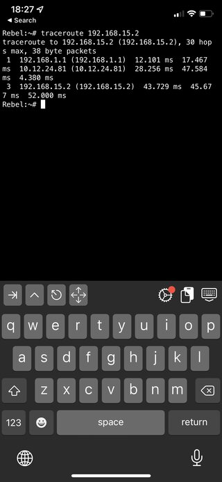


## Phone --> Lubuntu 3


```
ping
```

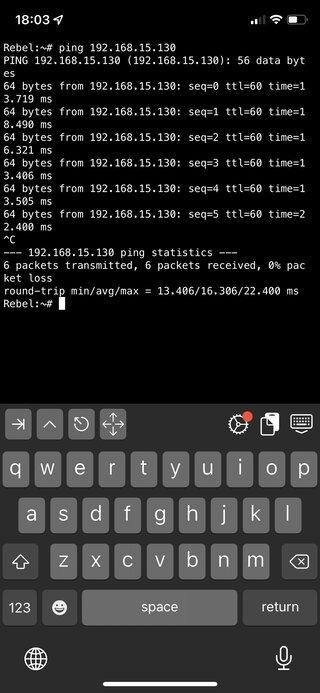


```
traceroute
```

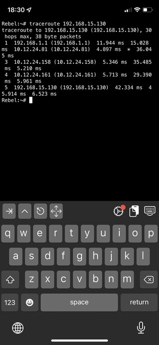


## Phone --> Switch 1,2 


```
ping
```

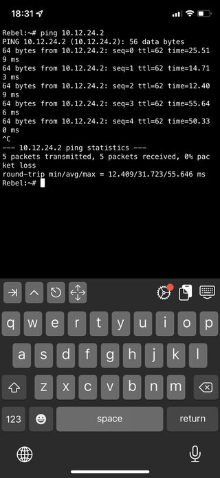

```
ssh
```

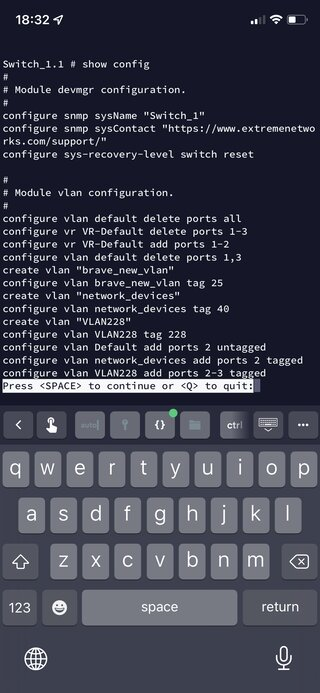


## Phone --> Apache HTTP server (Lubuntu 3)


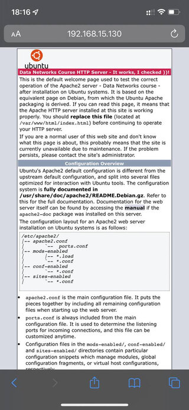

### Side note: for some mysterious reason I could not connect to the Apache server from my phone but I connected to this server with another phone and with the laptop. 


## Laptop --> Apache HTTP server (Lubuntu 3)

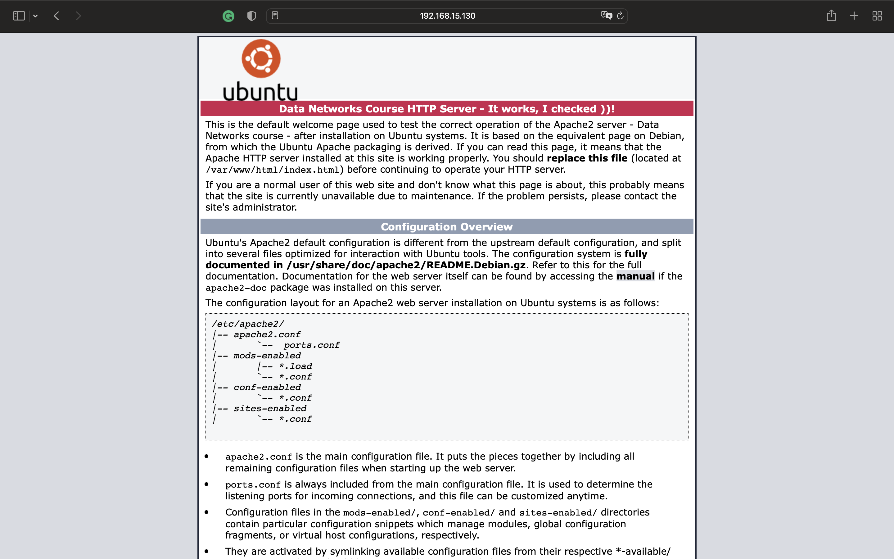


