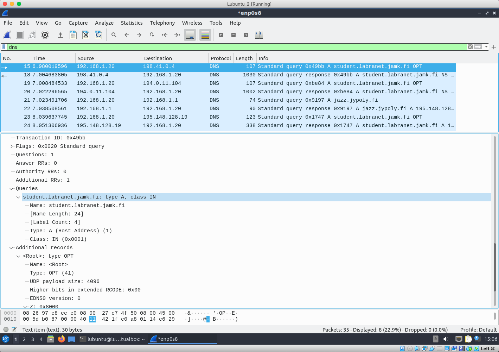
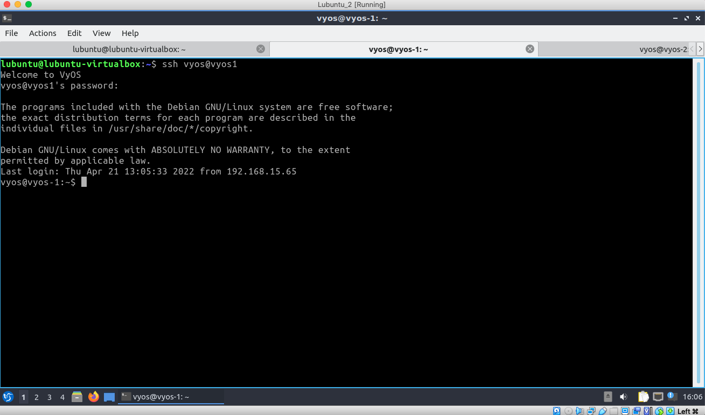

# Documentation for E15

## Goal 

The goal of this assignment was to get familiar with DNS and investigate DNS packets on the internet and within the topology.  

##  DNS on the Internet


```
dig +trace student.labranet.jamk.fi
```


```
lubuntu@lubuntu-virtualbox:~$ dig +trace student.labranet.jamk.fi

; <<>> DiG 9.16.1-Ubuntu <<>> +trace student.labranet.jamk.fi
;; global options: +cmd
.                       7042    IN      NS      k.root-servers.net.
.                       7042    IN      NS      j.root-servers.net.
.                       7042    IN      NS      i.root-servers.net.
.                       7042    IN      NS      h.root-servers.net.
.                       7042    IN      NS      g.root-servers.net.
.                       7042    IN      NS      f.root-servers.net.
.                       7042    IN      NS      e.root-servers.net.
.                       7042    IN      NS      d.root-servers.net.
.                       7042    IN      NS      c.root-servers.net.
.                       7042    IN      NS      b.root-servers.net.
.                       7042    IN      NS      a.root-servers.net.
.                       7042    IN      NS      m.root-servers.net.
.                       7042    IN      NS      l.root-servers.net.
;; Received 262 bytes from 127.0.0.53#53(127.0.0.53) in 0 ms

fi.                     172800  IN      NS      b.fi.
fi.                     172800  IN      NS      c.fi.
fi.                     172800  IN      NS      f.fi.
fi.                     172800  IN      NS      g.fi.
fi.                     172800  IN      NS      i.fi.
fi.                     172800  IN      NS      h.fi.
fi.                     172800  IN      NS      e.fi.
fi.                     172800  IN      NS      j.fi.
fi.                     172800  IN      NS      d.fi.
fi.                     172800  IN      NS      a.fi.
fi.                     86400   IN      DS      54049 8 2 924E552F60CBC5AA2517D0F59D658B119F211113E9A98F34402396EC 8A96A2D1
fi.                     86400   IN      RRSIG   DS 8 1 86400 20220504050000 20220421040000 47671 . lc5emo546wckIOIt7kyPvCaioEYz9XSBIj/o32omalXtkT6wKTbc2Qsj +VpUXJisli2LDSnf9ohaYBTwQaPSeLnbyow80c+/y8jeAlfjGcgqq/sG bOqJ2Wi1BIw2RhjzZbAQuiZDUGozOOgX9DXZTkPPHHwnwDKKHOvpMqVd FW7jRmD/eaFubPOouZ44u8geQtrJKtBgjUB3yN7RekkQeYPHwP9JycXj eCWfPALjPYLxJmzGdsaFjSOATdcgqpRof248he+P3eBmUFWLb4pUknIz Cha/rUU6mkp6Y6c4hSsOlLFADiwOBbA2JBhYVZBMJcqCL68d9K4aIdCZ YrT39Q==
;; Received 988 bytes from 198.41.0.4#53(a.root-servers.net) in 24 ms

jamk.fi.                21600   IN      NS      humppa.jypoly.fi.
jamk.fi.                21600   IN      NS      tango.jypoly.fi.
jamk.fi.                21600   IN      NS      jazz.jypoly.fi.
85d4jmpjj0e5h03tf3i3pai7qpr1930h.fi. 86400 IN NSEC3 1 1 5 48181D11B102D28D 85D71083A9M151IDIDQKJOVHL2I8A6VA NS SOA TXT RRSIG DNSKEY NSEC3PARAM
85d4jmpjj0e5h03tf3i3pai7qpr1930h.fi. 86400 IN RRSIG NSEC3 8 2 86400 20220501163329 20220417102621 10090 fi. C7vRRGYmIBs+ivQHXUcVHskUAWlNXzCgzp96QWREv0Kcqth084kcVJXY sWqs7o22pfobBHxQ4JAyU2G66CF2SI7dAi+7cah9zSmZuiwqulgwW032 29H7qtitTbzqBA/Da4iMblFKQXf4CkFonhcysWZ53sKQJHUNcweuurgd ksSCZf1oTK1woyrmj3TZEabu/WwV4hHJUnkRsWPAhf9LE78iPB3ZGehf SCgXTzw4H1vgNUjyTmLAggfX7GVdZ8tJZDisHRvIsirXEu+t9RWxwT6O 1vYzp2/4jMxrWhk/jyYNCRLWmSrzL9dHGw/Zfz88KNyvhJQE/4eOwb5B 4VSoDg==
hkumgvtf5vqf8lf8jemuqce07vb05df6.fi. 86400 IN NSEC3 1 1 5 48181D11B102D28D HKUVRSMTTCRU27UGNTIFJ8REVU9EPP62 NS DS RRSIG
hkumgvtf5vqf8lf8jemuqce07vb05df6.fi. 86400 IN RRSIG NSEC3 8 2 86400 20220505161654 20220421092623 10090 fi. tjXQrQFkC2cUmjRySWClk++fO1NGWUUzB1LwMngPkJ0dxvtKPVI1+SzU 5CF+pLTx8XyQxQr494aA4gzH3tEXIKP0ZCx3STWvE4WtaglPzWMN/w8d UAuapMY+Yzhyegc9cDa0eg38pOtQl5kq4x0CGy8AyEHq7/eGhAz2OAAH AjTssHMWumgyIplac6typ6y8GBGAcyHo3YwppR2myNd9MswDt4Jclo/C gSEImCAt7xuBiitlEQqj3U5a44cBRcd0uuAYJrxzSTNzeW2oOht45+y4 JiVnL/TqQWUNuCRsV8/eBhel39dbNQOt/l6OoUgFpdgweSChhBv6E2s6 Rb90yQ==
;; Received 960 bytes from 194.0.11.104#53(c.fi) in 12 ms

student.labranet.jamk.fi. 60    IN      A       195.148.26.130
jamk.fi.                86400   IN      NS      humppa.jypoly.fi.
jamk.fi.                86400   IN      NS      jazz.jypoly.fi.
jamk.fi.                86400   IN      NS      tango.jypoly.fi.
;; Received 296 bytes from 195.148.128.19#53(jazz.jypoly.fi) in 12 ms
```




### In these Wireshark captures we can see multiple IP addresses related to the `student.labranet.jamk.fi`. Moreover, I found an additional address `jazz.jypoly.fi`

## DNS in the topology

### Giving names to the host IPs (made on Lubuntu 2)


## Connectivity tests 

### **Lubuntu 2 --> Vyos1,Vyos2,Vyos3**

```
ping
```

```
lubuntu@lubuntu-virtualbox:~$ ping -c5 vyos1
PING vyos1 (10.12.24.245) 56(84) bytes of data.
64 bytes from vyos1 (10.12.24.245): icmp_seq=1 ttl=64 time=29.7 ms
64 bytes from vyos1 (10.12.24.245): icmp_seq=2 ttl=64 time=27.8 ms
64 bytes from vyos1 (10.12.24.245): icmp_seq=3 ttl=64 time=26.4 ms
64 bytes from vyos1 (10.12.24.245): icmp_seq=4 ttl=64 time=23.5 ms
64 bytes from vyos1 (10.12.24.245): icmp_seq=5 ttl=64 time=20.7 ms

--- vyos1 ping statistics ---
5 packets transmitted, 5 received, 0% packet loss, time 4010ms
rtt min/avg/max/mdev = 20.712/25.611/29.687/3.180 ms
lubuntu@lubuntu-virtualbox:~$ ping -c5 vyos2
PING vyos2 (10.12.24.246) 56(84) bytes of data.
64 bytes from vyos2 (10.12.24.246): icmp_seq=1 ttl=62 time=5.74 ms
64 bytes from vyos2 (10.12.24.246): icmp_seq=2 ttl=62 time=5.73 ms
64 bytes from vyos2 (10.12.24.246): icmp_seq=3 ttl=62 time=5.44 ms
64 bytes from vyos2 (10.12.24.246): icmp_seq=4 ttl=62 time=7.01 ms
64 bytes from vyos2 (10.12.24.246): icmp_seq=5 ttl=62 time=8.01 ms

--- vyos2 ping statistics ---
5 packets transmitted, 5 received, 0% packet loss, time 4008ms
rtt min/avg/max/mdev = 5.439/6.385/8.006/0.975 ms
lubuntu@lubuntu-virtualbox:~$ ping -c5 vyos3
PING vyos3 (10.12.24.247) 56(84) bytes of data.

--- vyos3 ping statistics ---
5 packets transmitted, 0 received, 100% packet loss, time 4073ms
```

### Side note: Vyos 3 curently has an active firewall thus ping is not possible.


```
ssh
```




```
http
```


### **Lubuntu 2 --> Switch1,Switch2,Switch3**

```
ping
```

```
lubuntu@lubuntu-virtualbox:~$ ping -c5 switch1
PING switch1 (10.12.24.1) 56(84) bytes of data.
64 bytes from switch1 (10.12.24.1): icmp_seq=1 ttl=63 time=83.6 ms
64 bytes from switch1 (10.12.24.1): icmp_seq=2 ttl=63 time=36.2 ms
64 bytes from switch1 (10.12.24.1): icmp_seq=3 ttl=63 time=35.1 ms
64 bytes from switch1 (10.12.24.1): icmp_seq=4 ttl=63 time=33.3 ms
64 bytes from switch1 (10.12.24.1): icmp_seq=5 ttl=63 time=32.1 ms

--- switch1 ping statistics ---
5 packets transmitted, 5 received, 0% packet loss, time 4008ms
rtt min/avg/max/mdev = 32.062/44.064/83.584/19.811 ms
lubuntu@lubuntu-virtualbox:~$ ping -c5 switch2
PING switch2 (10.12.24.2) 56(84) bytes of data.
64 bytes from switch2 (10.12.24.2): icmp_seq=1 ttl=63 time=35.1 ms
64 bytes from switch2 (10.12.24.2): icmp_seq=2 ttl=63 time=31.7 ms
64 bytes from switch2 (10.12.24.2): icmp_seq=3 ttl=63 time=29.0 ms
64 bytes from switch2 (10.12.24.2): icmp_seq=4 ttl=63 time=28.1 ms
64 bytes from switch2 (10.12.24.2): icmp_seq=5 ttl=63 time=76.8 ms

--- switch2 ping statistics ---
5 packets transmitted, 5 received, 0% packet loss, time 4007ms
rtt min/avg/max/mdev = 28.068/40.154/76.838/18.504 ms
lubuntu@lubuntu-virtualbox:~$ ping -c5 switch3
PING switch3 (10.12.24.3) 56(84) bytes of data.
64 bytes from switch3 (10.12.24.3): icmp_seq=1 ttl=63 time=30.5 ms
64 bytes from switch3 (10.12.24.3): icmp_seq=2 ttl=63 time=28.2 ms
64 bytes from switch3 (10.12.24.3): icmp_seq=3 ttl=63 time=24.4 ms
64 bytes from switch3 (10.12.24.3): icmp_seq=4 ttl=63 time=22.6 ms
64 bytes from switch3 (10.12.24.3): icmp_seq=5 ttl=63 time=24.5 ms

--- switch3 ping statistics ---
5 packets transmitted, 5 received, 0% packet loss, time 4007ms
rtt min/avg/max/mdev = 22.623/26.074/30.531/2.882 ms
lubuntu@lubuntu-virtualbox:~$ 
```

```
ssh
```


```
http
```


### **Lubuntu 2 --> Lubuntu 3** 

```
ping
```

```
lubuntu@lubuntu-virtualbox:~$ ping -c5 lubuntu3.grigory.provodin
PING lubuntu3.grigory.provodin (192.168.15.130) 56(84) bytes of data.
64 bytes from lubuntu3.grigory.provodin (192.168.15.130): icmp_seq=1 ttl=61 time=23.2 ms
64 bytes from lubuntu3.grigory.provodin (192.168.15.130): icmp_seq=2 ttl=61 time=19.9 ms
64 bytes from lubuntu3.grigory.provodin (192.168.15.130): icmp_seq=3 ttl=61 time=19.0 ms
64 bytes from lubuntu3.grigory.provodin (192.168.15.130): icmp_seq=4 ttl=61 time=17.1 ms
64 bytes from lubuntu3.grigory.provodin (192.168.15.130): icmp_seq=5 ttl=61 time=15.6 ms

--- lubuntu3.grigory.provodin ping statistics ---
5 packets transmitted, 5 received, 0% packet loss, time 4006ms
rtt min/avg/max/mdev = 15.573/18.963/23.189/2.594 ms
```


```
http
```


```
traceroute --resolve-hostnames lubuntu3.grigory.provodin
```

```
lubuntu@lubuntu-virtualbox:~$ traceroute --resolve-hostnames lubuntu3.grigory.provodin
traceroute to lubuntu3.grigory.provodin (192.168.15.130), 64 hops max
  1   192.168.15.126 (_gateway)  10,332ms  4,961ms  39,591ms 
  2   10.12.24.158 (10.12.24.158)  5,551ms  4,450ms  38,714ms 
  3   10.12.24.161 (10.12.24.161)  7,253ms  34,630ms  6,255ms 
  4   192.168.15.130 (lubuntu3.grigory.provodin)  5,258ms  5,006ms  36,278ms 
```