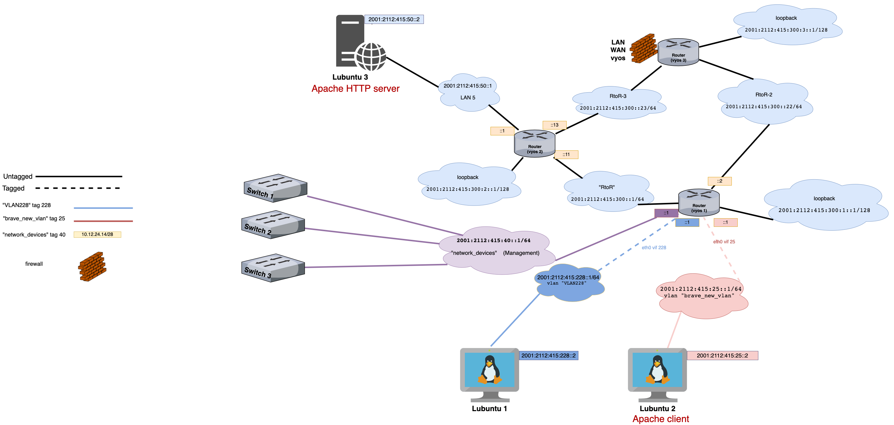
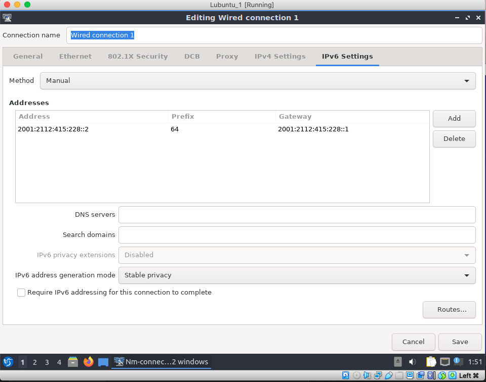
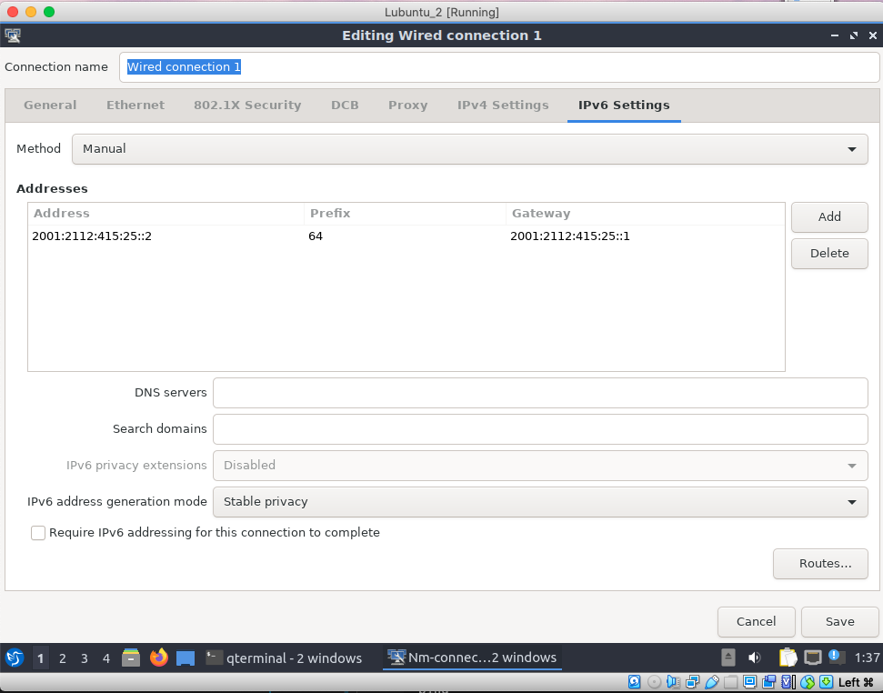
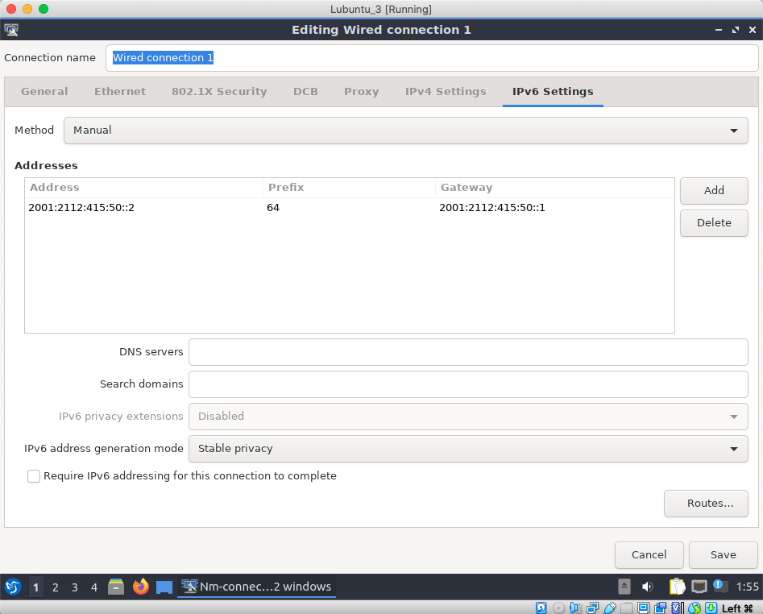
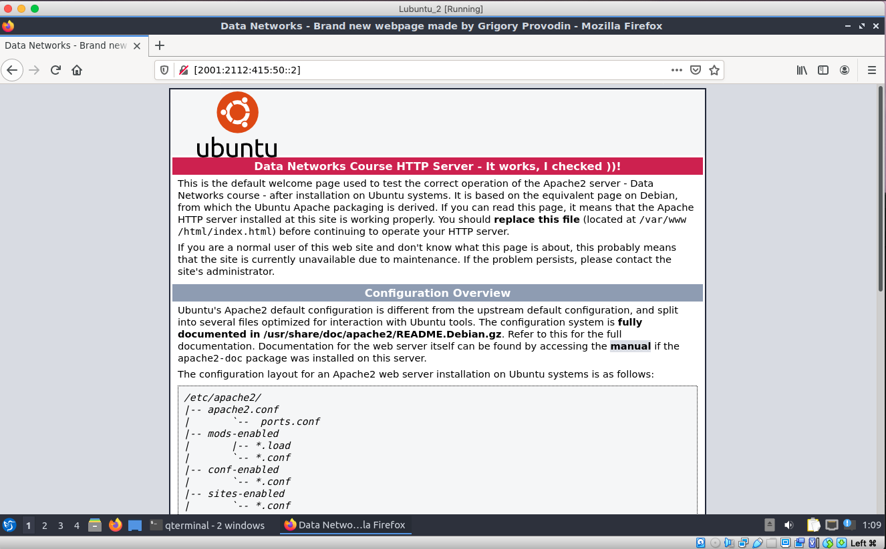

# Documentation for E16

## Goals

The goals of this assignment were to configure IPv6 addresses within the topology and address devices to these addresses.


## Configurations

* [Vyos 1](E16/vyos-1.cfg)
* [Vyos 2](E16/vyos-2.cfg)
* [Vyos 3](E16/vyos-3.cfg)

## Logical IPv6 topology 




### Logical calculations

```
2112415 - my student number 
vvxyzki

Thus we get these IPV6 addresses:

2001:2112:415:<subnets>::/64 - vlans 

2001:2112:415:<subnets>::/128 - loopbacks 
```

### IPv6 addresses 

```
2001:2112:415:25::/64 - brave_new_vlan tag 25
2001:2112:415:40::1/64  - network_devices tag 40
2001:2112:415:228::1/64 - VLAN228 tag 228 
2001:2112:415:50::1/64 - LAN5
```

## Addressing Vyoses manually 

### **Vyos 1**

```
set interfaces ethernet eth0 vif 25 address 2001:2112:415:25::1/64 - brave_new_vlan
set interfaces ethernet eth0 vif 40 address 2001:2112:415:40::1/64 - network_devices
set interfaces ethernet eth0 vif 228 address 2001:2112:415:228::1/64 - VLAN 228


set interfaces ethernet eth1 address 2001:2112:415:300::1/64 - RtoR
set interfaces ethernet eth2 address 2001:2112:415:300::2/64 - RtoR_2
set interfaces loopback lo address 2001:2112:415:300:1::1/128 - loopback


set protocols ospfv3 parameters router-id 10.12.24.245 - loopback 
set protocols ospfv3 area 0.0.0.0 interface eth0.25 - brave_new_vlan
set protocols ospfv3 area 0.0.0.0 interface eth0.40 - network_devices
set protocols ospfv3 area 0.0.0.0 interface eth0.228 - VLAN 228
set protocols ospfv3 area 0.0.0.0 interface eth1 - RtoR
set protocols ospfv3 area 0.0.0.0 interface eth2 - RtoR_2
```

```
show interfaces
```

```
vyos@vyos-1:~$ show interfaces 
Codes: S - State, L - Link, u - Up, D - Down, A - Admin Down
Interface        IP Address                        S/L  Description
---------        ----------                        ---  -----------
eth0             -                                 u/u  
eth0.25          192.168.15.126/26                 u/u  brave_new_vlan 
                 2001:2112:415:25::1/64
eth0.40          10.12.24.14/28                    u/u  network_devices 
                 2001:2112:415:40::1/64
eth0.228         192.168.15.62/26                  u/u  VLAN228 
                 2001:2112:415:228::1/64
eth1             10.12.24.253/30                   u/u  RtoR 
                 2001:2112:415:300::1/64
eth2             10.12.24.145/28                   u/u  RtoR-2 
                 2001:2112:415:300::2/64
eth3             10.12.24.81/28                    u/u  WIFI 
lo               127.0.0.1/8                       u/u  
                 10.12.24.245/32
                 2001:2112:415:300:1::1/128
                 ::1/128
```

### **Vyos 2**

```
set interfaces ethernet eth0 address 2001:2112:415:300::13/64 - RtoR_3
set interfaces ethernet eth1 address 2001:2112:415:300::11/64 - RtoR
set interfaces ethernet eth2 address 2001:2112:415:50::1/64 - LAN5
set interfaces loopback lo address 2001:2112:415:300:2::1/128 - loopback 

set protocols ospfv3 parameters router-id 10.12.24.246 - loopback
set protocols ospfv3 area 0.0.0.0 interface eth0 - RtoR_3
set protocols ospfv3 area 0.0.0.0 interface eth1 - RtoR
set protocols ospfv3 area 0.0.0.0 interface eth2 - LAN5
```


```
show interfaces
```


```
vyos@vyos-2:~$ show interfaces
Codes: S - State, L - Link, u - Up, D - Down, A - Admin Down
Interface        IP Address                        S/L  Description
---------        ----------                        ---  -----------
eth0             10.12.24.161/28                   u/u  RtoR-3 
                 2001:2112:415:300::13/64
eth1             10.12.24.254/30                   u/u  RtoR 
                 2001:2112:415:300::11/64
eth2             192.168.15.129/26                 u/u  LAN5 
                 2001:2112:415:50::1/64
lo               127.0.0.1/8                       u/u  
                 10.12.24.246/32
                 2001:2112:415:300:2::1/128
                 ::1/128

```


### **Vyos 3** 

```
set interfaces ethernet eth0 address 2001:2112:415:300::23/64 - RtoR-3
set interfaces ethernet eth3 address 2001:2112:415:300::22/64 - RtoR-2
set interfaces loopback lo address 2001:2112:415:300:3::1/128 - loopback 


set protocols ospfv3 parameters router-id 10.12.24.247 - loopback
set protocols ospfv3 area 0.0.0.0 interface eth0 - RtoR-3
set protocols ospfv3 area 0.0.0.0 interface eth3 - RtoR-2

set firewall ipv6-name LAN_to_vyos_ipv6 default-action drop
set firewall ipv6-name LAN_to_vyos_ipv6 rule 10 action accept
set firewall ipv6-name LAN_to_vyos_ipv6 rule 10 protocol ospf
set firewall ipv6-name vyos_to_LAN_ipv6 default-action drop
set firewall ipv6-name vyos_to_LAN_ipv6 rule 10 action accept
set firewall ipv6-name vyos_to_LAN_ipv6 rule 10 protocol ospf
set zone-policy zone LAN from vyos firewall ipv6-name vyos_to_LAN_ipv6
set zone-policy zone vyos from LAN firewall ipv6-name LAN_to_vyos_ipv6
```


```
show interfaces
```

```
vyos@vyos-3:~$ show interfaces
Codes: S - State, L - Link, u - Up, D - Down, A - Admin Down
Interface        IP Address                        S/L  Description
---------        ----------                        ---  -----------
eth0             10.12.24.174/28                   u/u  RtoR-3 
                 2001:2112:415:300::23/64
eth2             100.24.15.1/24                    u/u  public 
eth3             10.12.24.158/28                   u/u  RtoR-2 
                 2001:2112:415:300::22/64
lo               127.0.0.1/8                       u/u  
                 10.12.24.247/32
                 2001:2112:415:300:3::1/128
                 ::1/128
```

## Addressing Lubuntus manually 









## Testing connectivity 

```
vyos@vyos-1:~$ show ipv6 ospfv3 neighbor 
Neighbor ID     Pri    DeadTime    State/IfState         Duration I/F[State]                   
10.12.24.246      1    00:00:32     Full/BDR             00:21:24 eth1[DR]                     
10.12.24.247      1    00:00:36  ExStart/BDR             00:11:23 eth2[DR]                     

vyos@vyos-1:~$ show ipv6 ospfv3 route 
*N IA 2001:2112:415:25::/64          ::                        eth0.25 02:07:36                
*N IA 2001:2112:415:40::/64          ::                        eth0.40 02:07:36                
*N IA 2001:2112:415:50::/64          fe80::a00:27ff:fe92:2014    eth1 00:21:38                 
*N IA 2001:2112:415:228::/64         ::                        eth0.228 02:07:36               
*N IA 2001:2112:415:300::/64         ::                          eth1 02:07:36                 
 N IA 2001:2112:415:300::/64         ::                          eth1 00:21:43                 
 N IA 2001:2112:415:300::/64         fe80::a00:27ff:fe92:2014    eth1 00:21:38
```

```
vyos@vyos-2:~$ show ipv6 ospfv3 neighbor
Neighbor ID     Pri    DeadTime    State/IfState         Duration I/F[State]
10.12.24.247      1    00:00:39  ExStart/BDR             00:12:10 eth0[DR]
10.12.24.245      1    00:00:33     Full/DR              00:22:10 eth1[BDR]

vyos@vyos-2:~$ show ipv6 ospfv3 route 
*N IA 2001:2112:415:25::/64          fe80::a00:27ff:fea5:ef9     eth1 00:22:15
*N IA 2001:2112:415:40::/64          fe80::a00:27ff:fea5:ef9     eth1 00:22:15
*N IA 2001:2112:415:50::/64          ::                          eth2 00:22:24
*N IA 2001:2112:415:228::/64         fe80::a00:27ff:fea5:ef9     eth1 00:22:15
*N IA 2001:2112:415:300::/64         ::                          eth0 00:22:20
 N IA 2001:2112:415:300::/64         ::                          eth1 00:22:20
 N IA 2001:2112:415:300::/64         fe80::a00:27ff:fea5:ef9     eth1 00:22:15
```

```
vyos@vyos-3:~$ show ipv6 ospfv3 neighbor
Neighbor ID     Pri    DeadTime    State/IfState         Duration I/F[State]                   
10.12.24.246      1    00:00:37  ExStart/DR              00:12:42 eth0[BDR]                    
10.12.24.245      1    00:00:34  ExStart/DR              00:12:47 eth3[BDR]                    

vyos@vyos-3:~$ show ipv6 ospfv3 route 
*N IA 2001:2112:415:300::/64         ::                          eth0 00:13:00                 
```


### **Lubuntu 2 --> Lubuntu 3**

```
ping
```

```
lubuntu@lubuntu-virtualbox:~$ ping 2001:2112:415:50::2
PING 2001:2112:415:50::2(2001:2112:415:50::2) 56 data bytes
64 bytes from 2001:2112:415:50::2: icmp_seq=1 ttl=62 time=5.67 ms
64 bytes from 2001:2112:415:50::2: icmp_seq=2 ttl=62 time=4.72 ms
64 bytes from 2001:2112:415:50::2: icmp_seq=3 ttl=62 time=5.14 ms
64 bytes from 2001:2112:415:50::2: icmp_seq=4 ttl=62 time=4.02 ms
64 bytes from 2001:2112:415:50::2: icmp_seq=5 ttl=62 time=4.61 ms
^C
--- 2001:2112:415:50::2 ping statistics ---
5 packets transmitted, 5 received, 0% packet loss, time 4009ms
rtt min/avg/max/mdev = 4.022/4.831/5.670/0.550 ms
```

```
traceroute6 -n
```


```
lubuntu@lubuntu-virtualbox:~$ traceroute6 -n 2001:2112:415:50::2
traceroute to 2001:2112:415:50::2 (2001:2112:415:50::2) from 2001:2112:415:25::2, 30 hops max, 24 byte packets
 1  2001:2112:415:25::1  3,1444 ms  2,0504 ms  2,0004 ms
 2  2001:2112:415:300::11  2,8015 ms  3,7495 ms  3,4125 ms
 3  2001:2112:415:50::2  3,8492 ms  20,6738 ms  2,8748 ms
```


```
http
```

