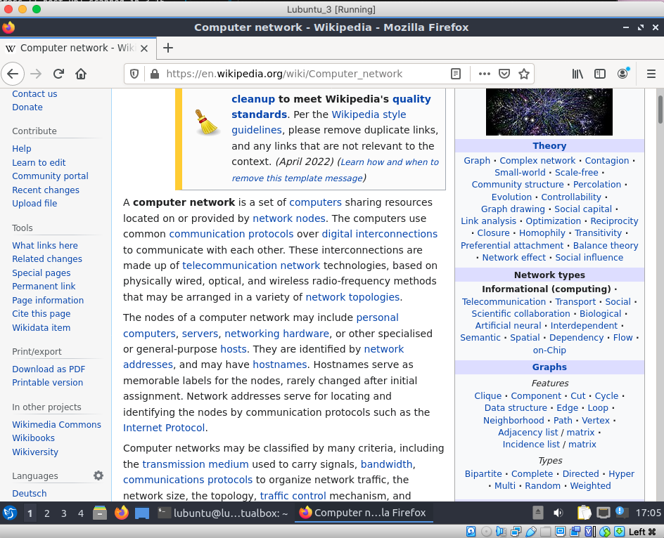

# Documentation for E17


>I chose option 1: "Connect your topology to the Internet (IPv4 only)". As a source of internet I will use my home router.

## Logical IPv4 topology 


## Physical topology 


## Vyos configurations 

* [Vyos 1](E17/vyos-1.cfg)
* [Vyos 2](E17/vyos-2.cfg)
* [Vyos 3](E17/vyos-3.cfg)

### Address range of my network is 192.168.1.0/24 while router IP is 192.168.1.1 

## Updating IPv4 configuration and making a default route on the Vyos 3

```
set interfaces ethernet eth2 address 192.168.1.50/24
set protocols static route 0.0.0.0/0 next-hop 192.168.1.1
set protocols ospf default-information originate metric-type 2
```

### NAT iterface was set towards eth2 which is now attached to the bridged interface thus there is no need in reconfiguring it.

## Updating DHCP servers on Vyos 1 and  Vyos 2 (Vyos 3 does not have a DHCP server)

### **Vyos 1**

```
set service dhcp-server shared-network-name VLAN228 subnet 192.168.15.0/26 dns-server 1.1.1.1

set service dhcp-server shared-network-name VLAN25 subnet 192.168.15.64/26 dns-server 1.1.1.1
```

### **Vyos 2**

```
set service dhcp-server shared-network-name LAN5 subnet 192.168.15.128/26 dns-server 1.1.1.1
```

## Connectivity tests 

### **Lubuntu 1**

```
ping
```

```
lubuntu@lubuntu-virtualbox:~$ ping -c 5 www.jamk.fi
PING www.jamk.fi (94.237.98.172) 56(84) bytes of data.
64 bytes from 94-237-98-172.de-fra1.upcloud.host (94.237.98.172): icmp_seq=1 ttl=50 time=38.0 ms
64 bytes from 94-237-98-172.de-fra1.upcloud.host (94.237.98.172): icmp_seq=2 ttl=50 time=40.0 ms
64 bytes from 94-237-98-172.de-fra1.upcloud.host (94.237.98.172): icmp_seq=3 ttl=50 time=41.0 ms
64 bytes from 94-237-98-172.de-fra1.upcloud.host (94.237.98.172): icmp_seq=4 ttl=50 time=37.1 ms
64 bytes from 94-237-98-172.de-fra1.upcloud.host (94.237.98.172): icmp_seq=5 ttl=50 time=39.5 ms

--- www.jamk.fi ping statistics ---
5 packets transmitted, 5 received, 0% packet loss, time 4006ms
rtt min/avg/max/mdev = 37.080/39.108/40.956/1.391 ms
```


```
nmap -sn --traceroute
```

```
lubuntu@lubuntu-virtualbox:~$ sudo nmap -sn --traceroute www.jamk.fi
Starting Nmap 7.80 ( https://nmap.org ) at 2022-04-24 16:58 EEST
Nmap scan report for www.jamk.fi (94.237.98.172)
Host is up (0.043s latency).
rDNS record for 94.237.98.172: 94-237-98-172.de-fra1.upcloud.host

TRACEROUTE (using proto 1/icmp)
HOP RTT      ADDRESS
1   3.39 ms  _gateway (192.168.15.62)
2   5.46 ms  10.12.24.158
3   8.35 ms  192.168.1.1
4   8.38 ms  dsl-jklbng12-54fba0-3.dhcp.inet.fi (84.251.160.3)
5   14.03 ms 141.208.195.169
6   12.64 ms hls-b3-link.ip.twelve99.net (62.115.44.164)
7   36.63 ms s-bb1-link.ip.twelve99.net (62.115.122.32)
8   75.91 ms ffm-bb1-link.ip.twelve99.net (62.115.143.29)
9   77.46 ms ffm-b12-link.ip.twelve99.net (62.115.142.47)
10  75.95 ms upcloud-svc072803-ic360431.ip.twelve99-cust.net (62.115.173.127)
11  ... 19
20  71.80 ms 94-237-98-172.de-fra1.upcloud.host (94.237.98.172)

Nmap done: 1 IP address (1 host up) scanned in 3.25 seconds
```


```
browsing internet
```


### **Lubuntu 2**

```
ping
```

```
lubuntu@lubuntu-virtualbox:~$ ping -c 5 www.jamk.fi
PING www.jamk.fi (94.237.98.172) 56(84) bytes of data.
64 bytes from 94-237-98-172.de-fra1.upcloud.host (94.237.98.172): icmp_seq=1 ttl=50 time=37.7 ms
64 bytes from 94-237-98-172.de-fra1.upcloud.host (94.237.98.172): icmp_seq=2 ttl=50 time=39.4 ms
64 bytes from 94-237-98-172.de-fra1.upcloud.host (94.237.98.172): icmp_seq=3 ttl=50 time=39.5 ms
64 bytes from 94-237-98-172.de-fra1.upcloud.host (94.237.98.172): icmp_seq=4 ttl=50 time=38.9 ms
64 bytes from 94-237-98-172.de-fra1.upcloud.host (94.237.98.172): icmp_seq=5 ttl=50 time=41.1 ms

--- www.jamk.fi ping statistics ---
5 packets transmitted, 5 received, 0% packet loss, time 4003ms
rtt min/avg/max/mdev = 37.740/39.338/41.102/1.081 ms
```


```
nmap -sn --traceroute
```

```
lubuntu@lubuntu-virtualbox:~$ sudo nmap -sn --traceroute www.jamk.fi
[sudo] password for lubuntu: 
Starting Nmap 7.80 ( https://nmap.org ) at 2022-04-24 16:06 EEST
Nmap scan report for www.jamk.fi (94.237.98.172)
Host is up (0.042s latency).
rDNS record for 94.237.98.172: 94-237-98-172.de-fra1.upcloud.host

TRACEROUTE (using port 443/tcp)
HOP RTT      ADDRESS
1   3.23 ms  _gateway (192.168.15.126)
2   5.88 ms  10.12.24.158
3   8.68 ms  192.168.1.1
4   ... 5
6   13.90 ms hls-b3-link.ip.twelve99.net (62.115.44.164)
7   19.79 ms s-bb2-link.ip.twelve99.net (62.115.122.34)
8   49.90 ms ffm-bb2-link.ip.twelve99.net (62.115.138.105)
9   49.94 ms ffm-b12-link.ip.twelve99.net (62.115.142.47)                               
10  48.03 ms upcloud-svc072803-ic360431.ip.twelve99-cust.net (62.115.173.127)
11  ... 14
15  38.42 ms 94-237-98-172.de-fra1.upcloud.host (94.237.98.172)

Nmap done: 1 IP address (1 host up) scanned in 3.22 seconds
```

```
browsing internet
```


### **Lubuntu 3**

```
ping
```

```
lubuntu@lubuntu-virtualbox:~$ ping -c 5 www.jamk.fi
PING www.jamk.fi (94.237.98.172) 56(84) bytes of data.
64 bytes from 94-237-98-172.de-fra1.upcloud.host (94.237.98.172): icmp_seq=1 ttl=50 time=34.6 ms
64 bytes from 94-237-98-172.de-fra1.upcloud.host (94.237.98.172): icmp_seq=2 ttl=50 time=36.9 ms
64 bytes from 94-237-98-172.de-fra1.upcloud.host (94.237.98.172): icmp_seq=3 ttl=50 time=34.2 ms
64 bytes from 94-237-98-172.de-fra1.upcloud.host (94.237.98.172): icmp_seq=4 ttl=50 time=36.5 ms
64 bytes from 94-237-98-172.de-fra1.upcloud.host (94.237.98.172): icmp_seq=5 ttl=50 time=36.1 ms

--- www.jamk.fi ping statistics ---
5 packets transmitted, 5 received, 0% packet loss, time 4006ms
rtt min/avg/max/mdev = 34.190/35.677/36.945/1.083 ms
```


```
nmap -sn --traceroute
```

```
lubuntu@lubuntu-virtualbox:~$ sudo nmap -sn --traceroute www.jamk.fi
[sudo] password for lubuntu: 
Starting Nmap 7.80 ( https://nmap.org ) at 2022-04-24 17:04 EEST
Nmap scan report for www.jamk.fi (94.237.98.172)
Host is up (0.041s latency).
rDNS record for 94.237.98.172: 94-237-98-172.de-fra1.upcloud.host

TRACEROUTE (using proto 1/icmp)
HOP RTT      ADDRESS                                                                        
1   1.02 ms  _gateway (192.168.15.129)                                                      
2   1.94 ms  10.12.24.174                                                                   
3   3.98 ms  192.168.1.1                                                                    
4   4.18 ms  dsl-jklbng12-54fba0-3.dhcp.inet.fi (84.251.160.3)                              
5   7.76 ms  141.208.195.169
6   7.78 ms  hls-b3-link.ip.twelve99.net (62.115.44.164)
7   32.73 ms s-bb1-link.ip.twelve99.net (62.115.122.32)
8   91.51 ms ffm-bb1-link.ip.twelve99.net (62.115.143.29)
9   91.52 ms ffm-b12-link.ip.twelve99.net (62.115.142.47)
10  91.52 ms upcloud-svc072803-ic360431.ip.twelve99-cust.net (62.115.173.127)
11  ... 14
15  63.14 ms 94-237-98-172.de-fra1.upcloud.host (94.237.98.172)

Nmap done: 1 IP address (1 host up) scanned in 3.15 seconds
```


```
browsing internet
```


